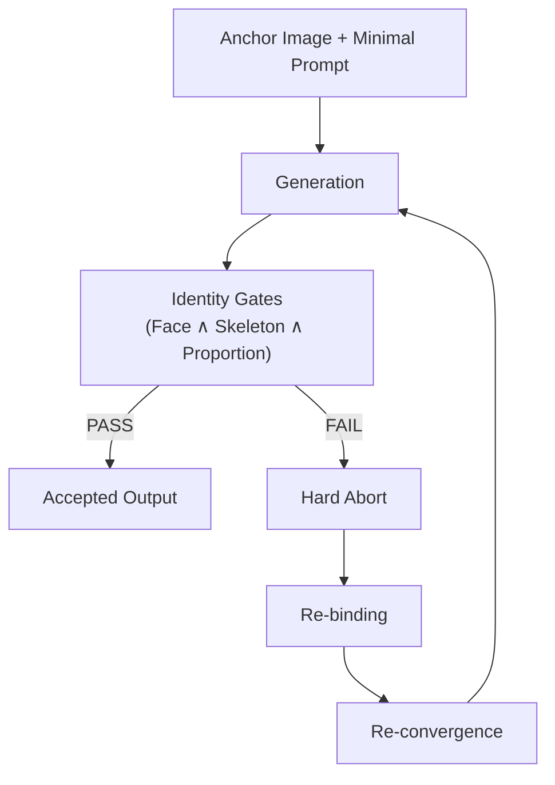
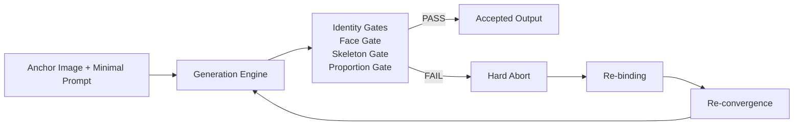
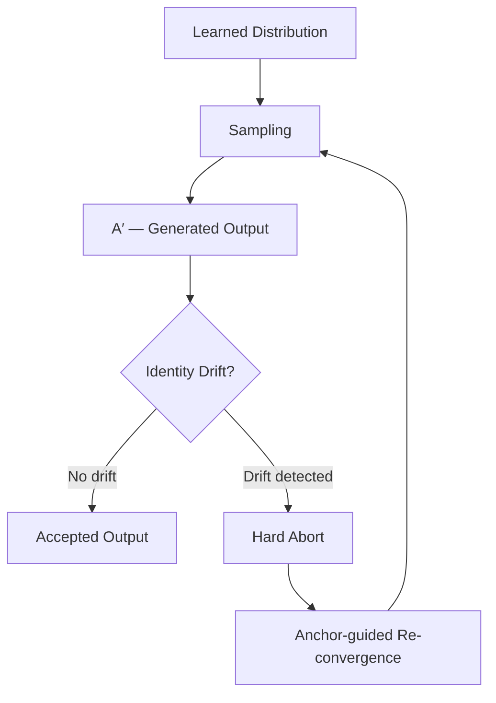

# Character Identity Protocol (CIP)

AI does not execute your input.
It reconstructs it.

```
A → A′ → B′
```

This is why identity drifts.

**CIP controls A′.**

```
Core Model:     A → A′ → B′  (Reconstruction Control Model, RCM)
Control Target: A′  (reconstructed state)
Key Mechanisms: Anchor constraint · Identity gates · Hard Abort & Re-convergence
```

Character Identity Protocol (CIP) is a governance-layer protocol
for stabilizing identity in probabilistic generative systems
by controlling reconstruction, validation, re-convergence, and abort conditions.

*Licensed under [CC BY 4.0](https://creativecommons.org/licenses/by/4.0/) — 2026*

-----

## At a Glance

### Problem

Generative AI systems do not execute user input directly.

They internally reconstruct it:

```
A (input) → A′ (reconstructed) → B′ (output)
```

As a result:

- The same prompt produces different outputs
- Character identity drifts over time
- Reproducibility is not guaranteed

This makes generative systems difficult to control in production environments.

-----

### Solution

CIP introduces a closed-loop control system that stabilizes identity by controlling the reconstruction process.

Instead of controlling output directly, CIP controls **A′** — the reconstructed problem.

```
          ┌──────────────┐
          │   Anchor     │
          └──────┬───────┘
                 ↓
A → A′ → B′ → Observation → Re-Convergence / Abort
```

CIP continuously:

- Constrains A′ using anchors
- Observes output deviation
- Restores identity when drift occurs
- Terminates invalid states

-----

### Key Components

|Component                         |Role                                                                |
|----------------------------------|--------------------------------------------------------------------|
|Reconstruction Model (A → A′ → B′)|Drift originates from reconstruction, not randomness                |
|Anchor Model                      |Low-entropy reference that constrains A′                            |
|Control Rules                     |Single command · Single state transition · Decompose complex changes|
|Anchor Re-Convergence Method      |Restores A′ to anchor-constrained state                             |
|Observation Layer                 |Identity Score · Consistency Score · Drift Score                    |
|Safety Mechanism                  |Hard Abort · Rollback to last stable state                          |

-----

### Positioning

CIP is **not**:

- A prompt engineering technique
- A model modification method (LoRA / fine-tuning)

CIP **is**:

> A governance-layer protocol for managing identity in generative systems.

→ [Complete Specification](docs/cip_complete_spec.md)  
→ [Technical Mechanism](docs/technical_mechanism.md)  
→ [White Paper](docs/whitepaper_v1.md)

-----

## Generative AI Mental Model

Generative image models do not retrieve or reproduce images from memory.
They reconstruct outputs by sampling from a probability distribution learned during training.

This means that even with identical inputs, outputs may vary.
Identity is not preserved automatically — it must be actively maintained.

```
Training Distribution
        ↓
Probabilistic Generation
        ↓
Character Drift
        ↓
User Intervention
        ↓
Character Identity Protocol (CIP)
```

Because generation is probabilistic, small changes in prompt, pose, or context can cause the model to reconstruct a different identity.
This is not a failure — it is the natural behavior of these systems.

CIP addresses this by operating at the **operational layer**, between the user and the model.
It does not modify the model itself.
Instead, it governs the conditions under which generation is allowed to continue:
controlling anchor references, validating identity gates, and triggering hard aborts when drift is detected.

> CIP stabilizes identity by governing generation conditions — not by modifying the model.

In practice, drift appears in multiple forms such as identity drift, proportion drift, style drift, and angle drift.
A detailed taxonomy is provided in the [Character Drift Taxonomy](docs/character_drift_taxonomy.md) document.

-----

The following section explains why character identity is inherently unstable in generative systems.

## The Problem

You generate an image of a character.
It is exactly right — the face, the proportions, the presence.

You try to generate the same character again.
It is different.

You try again.
Different again.

This is not a failure of skill. It is how generative AI works.

In generative image systems:

- The same prompt can produce different faces
- Character proportions may drift over iterations
- Identity consistency degrades across turns
- Cross-platform reproduction becomes unreliable

This is not a prompt engineering failure.
It is a property of **probabilistic generative systems**.

Each output is a new reconstruction sampled from the model’s learned distribution.
Without operational control, **identity drift emerges naturally**.

CIP was designed to operationally control this reconstruction behavior.

In image generation communities, this problem is often discussed as character consistency, identity preservation, or consistent character generation.
CIP addresses it at the operational governance layer.

-----

## The CIP Approach

Operationally, this governance layer functions as a convergence control protocol
applied during inference.

CIP treats character identity as a **convergence control problem**.

In other words, CIP does not attempt to generate identity; it recovers it.

Rather than enforcing strict instructions, the protocol aligns generation with the natural convergence behavior of the model.

CIP introduces four operational elements:

|Element       |Role                                            |
|--------------|------------------------------------------------|
|Anchor Image  |Previously validated identity reference         |
|Minimal Prompt|Lightweight identity constraints                |
|Identity Gates|Validation checks (Face ∧ Skeleton ∧ Proportion)|
|Hard Abort    |Immediate termination when drift occurs         |

Identity Gates are evaluated by the operator (typically a human reviewer), with optional metric-based verification.

Together these form a controlled generation loop.

> This is not a generation method.
> It is a character identity governance protocol.

CIP defines the validation gates. The similarity threshold is an operator-defined parameter.

-----

## Core Operational Loop — The CIP Convergence Loop

The CIP convergence loop is the central operational mechanism of the protocol:

```
Anchor Image + Minimal Prompt
        ↓
Generation
        ↓
Identity Gates
        ↓
PASS → Accepted Output
FAIL → Hard Abort → Re-bind Anchor → Re-converge
```

Identity is therefore **not assumed to persist**.

Instead, it is **continuously recovered through controlled convergence cycles**.



-----

## CIP Operational Architecture

*CIP governs generation acceptance through identity validation gates and hard-abort recovery cycles.*



-----

## Why Anchors Work

A previously generated image represents a **known converged solution** within the model’s output space. When supplied as a reference, the anchor guides generation toward a previously validated identity state. CIP guides generation toward high-density regions of the model’s learned distribution, where stable identity reconstruction is more likely to occur.



*CIP core mechanism: probabilistic sampling, identity drift, and anchor-guided re-convergence.*

→ [Technical Mechanism](docs/technical_mechanism.md)

-----

## Anchor Formation

Anchors are not assumed to exist.
They are created through a controlled one-shot convergence process.

```
Minimal Prompt + Generation
        ↓
Identity Gates (Face ∧ Skeleton ∧ Proportion)
        ↓
PASS → Anchor established
FAIL → Discard and retry
```

Only an output that passes all identity gates becomes an anchor.

> **Anchor = validated convergence state**

This formation step is not optional. Without a validated anchor, the CIP governance loop cannot begin.

This step defines the entry condition of the protocol.

-----

## Anchor Convergence (Operational Method)

CIP introduces an operational method called **Anchor Convergence**.

This method enables identity stabilization using:

- A single high-density sample (one-shot)
- Minimal prompt structure
- Identifier binding (naming)
- Multi-view expansion (character sheet)

### Core Idea

Generative models do not store identity.

Instead, identity must be re-converged from a stable region in latent space.

Anchor Convergence forces this process by:

1. Selecting a high-coherence sample
1. Binding it to a symbolic identifier
1. Reducing prompt entropy (minimal prompt)
1. Expanding identity across multiple views
1. Re-invoking the identity under controlled conditions

### Pipeline

```
High-Density Sample
→ Identifier (Name)
→ Minimal Prompt
→ Character Sheet Expansion
→ Re-Convergence
```

### Key Properties

- Does not require model fine-tuning (LoRA-free)
- Works across sessions (reset-tolerant)
- Increases recall probability of identity
- Reduces drift in A → A′ → B′ transformation

### Position in CIP

Anchor Convergence operates at:

- Level 3: Control Theory (latent targeting)
- Level 4: Execution Method (operational workflow)

This method targets high-density regions in the training distribution, where reconstruction probability is maximized. This behavior is referred to as **High-Density Latent Anchoring**.

-----

## Cycle-Based Stabilization

Identity stability exists within bounded convergence windows. CIP restores stability by re-injecting the anchor at cycle boundaries.

```
Cycle A → Drift → Re-binding → Cycle B
```

> Stability is chained through disciplined re-convergence — not assumed to persist indefinitely.

-----

## Failure Condition

CIP may legitimately produce no acceptable output.

If identity gates fail and identity cannot be restored within the current cycle:

> No acceptable output could be produced under the current conditions.

This is the expected behavior of a governed probabilistic workflow — not a system error.

-----

## Inference-Time Protocol

CIP operates **entirely at inference time** and does not modify model weights, training data, or internal architecture.

It constrains generation behavior through **input design and operational control**, making it compatible with closed-source systems.

-----

## Scope and Future Direction

CIP is currently focused on character identity stabilization in image generation workflows.

However, the protocol is not limited to image prompting practice alone.

Its underlying mechanisms — anchor-based convergence, identity validation gates, and hard-abort recovery — address a broader class of problems: maintaining a defined identity state across repeated probabilistic generation cycles.

Future directions may include:

- identity-sensitive generative pipelines beyond image generation
- agent-based systems where behavioral consistency requires verification
- operational AI governance frameworks requiring auditable identity constraints

These directions remain open research questions. CIP documents the operational layer; formal extension to other domains is outside the current scope.

-----

## Cross-Platform Pipeline

CIP is designed to govern identity stability across platforms, not within a single tool.

A representative production pipeline spans reference generation, anchor finalization, sequential generation, post-processing, and agent orchestration — each stage connected by the same identity validation layer.

The specific tools change; the operational protocol remains.

> CIP defines the operational governance layer — anchor management, identity gates, and hard-abort recovery — that remains applicable across generative platforms as individual tools evolve.

-----

## Scope Clarification

**This is NOT:**

- A prompt template library
- A fine-tuning method
- A LoRA training technique
- A model architecture modification

**This IS:**

- An operational governance protocol
- A statistical convergence control framework
- A validation discipline using structured gates

CIP is model-agnostic: it defines a conformance workflow, not a model capability claim or a platform feature requirement.

-----

## Review Notes (Expected Questions)

- **Does CIP claim determinism?**
  No. CIP is a governance workflow for *bounded* stability under gates within a context-bound window (cycle). It does not guarantee identical outputs.
- **Is CIP just prompt engineering?**
  No. CIP is an operational conformance loop: Anchor → Minimal Prompt → Gates → Hard Abort → Re-binding → Re-convergence.
- **What is the measurable claim?**
  CIP makes outcomes audit-ready: every PASS/FAIL is recorded as an operational audit trail (anchor ID, prompt hash, gate result, timestamp, operator).
  Human gate evaluation SHALL be primary; metrics MAY be added as verification.
  *Audit-ready = every PASS/FAIL is traceable to (anchor ID, prompt hash, gate result, timestamp, operator).*

-----

## Minimal Prompt Principle

CIP intentionally avoids highly specific prompt constraints.

Overly precise instructions can push the model away from the statistical regions where stable reconstructions occur.
Instead, CIP favors minimal attribute descriptions that leave room for the model to converge naturally.

**Example of rigid specification (often unstable):**

- 8-head body ratio
- exact height specification
- precise numeric constraints

**Example of minimal attribute description:**

- small head relative to height
- long limbs
- modest chest
- full thighs

The second form allows the model to search within its learned distribution more freely and often leads to more stable convergence toward the anchor.

In practice this means:

- Prompts describe invariant traits, not exact measurements
- Prompts remain short and abstract
- The anchor image carries the majority of identity information

CIP therefore treats prompts as identity hints, not full character definitions.
The anchor remains the primary stabilizer of identity.

```
Minimal Prompt → Model Exploration → Anchor Guidance → Convergence
```

-----

## Who This Is For

- AI labs researching generative consistency
- IP owners requiring character identity guarantees
- Anime, manga, illustration, and game production studios
- Franchise animation and serialized IP management teams
- Fashion and editorial production pipelines
- Enterprise governance and audit teams

-----

## If You Are Evaluating This Repository

If you are reviewing this for:

- Enterprise evaluation
- Research analysis
- Risk / compliance review
- Platform integration feasibility

Please refer to: [Decision Pack](docs/decision_pack.md)

-----

CIP reframes character identity from a static output property to a recoverable convergence state.

## Key Insight

Identity in generative systems does not persist automatically.

**It must be recovered through controlled convergence.**

> In CIP, the core verb is not *generate* — it is *recover*.
> 
> *Recover* = re-converge to a previously validated identity state (the anchor), under gates, until the identity constraints are met (PASS).

-----

## Reading Paths

**Researchers / Technical Review**  
[White Paper](docs/whitepaper_v1.md) → [Technical Mechanism](docs/technical_mechanism.md) → [Complete Specification](docs/cip_complete_spec.md)

**Practitioners**  
[Quickstart](docs/quickstart.md) → [Architecture Diagram](docs/architecture_diagram.md) → [Case Studies](docs/case_01_failure_log.md)

**Enterprise / Governance**  
[Decision Pack](docs/decision_pack.md) → [Complete Specification](docs/cip_complete_spec.md)

-----

## Documentation

**White Paper**

- [Character Identity Protocol v1.0](docs/whitepaper_v1.md)
- [Master Document — Consolidated Overview](docs/master_document.md)
- [Decision Pack — Enterprise Evaluation](docs/decision_pack.md)
- [Legal Governance & Operational Evidence Framework](docs/legal_governance.md)

**Core**

- [Quickstart Guide](docs/quickstart.md)
- [Technical Mechanism](docs/technical_mechanism.md)
- [Architecture Diagram](docs/architecture_diagram.md)
- [Applications Overview](docs/applications.md)
- [Glossary](docs/glossary.md)
- [Reproducibility Scope](docs/reproducibility_scope.md)

**Case Studies**

- [Case 01A: Baseline Failure](docs/case_01_failure_log.md)
- [Case 01B: Mira Project — Hard Abort & Re-convergence](docs/case_01b_mira_project.md)
- [Case 02: Wedding Series](docs/case_02_wedding_series.md)
- [Case 03: Avedon Project](docs/case_03_avedon_project.md)
- [Case 04: Cross-Platform Migration — “Shizuka”](docs/case_04_shizuka.md)
- [Case 05: Serendipitous Creation](docs/case_05_serendipitous.md)
- [Case 06: Gemini Validation](docs/case_06_gemini.md)

**Operational**

- [Quality Gate & Hard Abort Discipline](docs/quality_gate_addendum.md)
- [CIP Terminology Mapping](docs/cip_terminology_mapping.md)
- [CIP vs Existing Methods](docs/cip_vs_existing_methods.md)
- [CIP Complete Specification](docs/cip_complete_spec.md)

**Further Reading**

- [Miracle Images and Convergence Behavior](docs/column_miracle_image.md)
- [When AI Stops Being Art and Starts Becoming Production](docs/column_production.md)
- [Character Identity Drift in Generative AI — From Sakuga Collapse to CIP](docs/column_identity_drift.md)
- [Before Consistent Characters](docs/column_before_consistent_characters.md)
- [Identity Drift in Generative Image Models — A Practical Explanation](docs/column_identity_drift_practical.md)
- [Generative Character Drift — A Technical Overview](docs/column_character_drift_technical.md)
- [Character Drift Taxonomy](docs/character_drift_taxonomy.md)
- [How Generative AI Actually Behaves](docs/column_how_generative_ai_behaves.md)
- [A Simple Structure for Writing Prompts](docs/column_prompt_structure.md)
- [Writing Prompts for Image Generation](docs/column_image_prompt_structure.md)

> **Note:** “Identity Gates” is the current term for the validation layer. “Quality Gate” remains as a legacy document and addendum title for continuity.

-----

## Citation

If referencing this protocol in academic or professional work:

```bibtex
@misc{character_identity_protocol_2026,
  title={Character Identity Protocol: Operational Governance for Identity Convergence in Probabilistic Generative Systems},
  author={Watadani},
  year={2026},
  note={GitHub Repository},
  url={https://github.com/watadani-byte/character-identity-protocol}
}
```

-----

## Contribution

Issues are open for clarification and technical discussion.
Demonstration requests may be considered depending on scope and feasibility.

→ [Open an Issue](https://github.com/watadani-byte/character-identity-protocol/issues)

-----

## Next Phase

- Formal specification layer (normative terminology, gate definitions, conformance conditions)
- Enterprise pilot framework (audit templates, compliance guidelines)

This repository represents the stable conceptual and governance layer (v1.x series).

-----

## License

Licensed under CC BY 4.0: https://creativecommons.org/licenses/by/4.0/

-----

## Contact

For general discussion, please open a GitHub Issue. For professional or
research inquiries, contact details may be provided upon request.