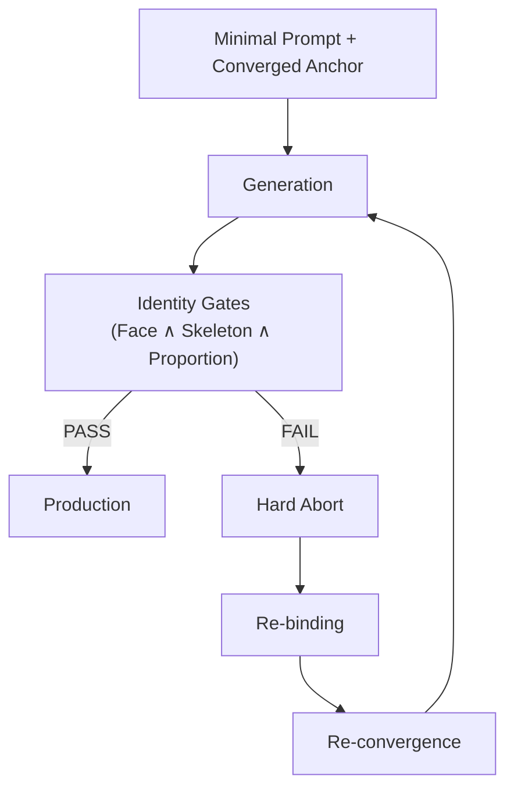

# Character Identity Protocol (CIP)

Operational workflow to keep a character consistent across generations, sessions, and platforms.  
*Licensed under [CC BY 4.0](https://creativecommons.org/licenses/by/4.0/) — 2026*

## The Problem CIP Solves

You generate an image of a character.
It is exactly right — the face, the proportions, the presence.

You try to generate the same character again.
It is different.

You try again.
Different again.

This is not a failure of skill. It is how generative AI works.

Each generation is statistically independent.
Even with the same prompt, the model may produce a different face,
different proportions, or a different identity.

CIP was created to solve this operational problem.

It does not modify the model.
It does not require fine-tuning.

Instead, it anchors the converged result — the image that was right —
and uses structured validation gates to maintain identity continuity
across subsequent generations.

When drift is detected, CIP stops the run immediately (Hard Abort)
and re-binds the anchor before continuing.

The result: character identity that is recoverable,
auditable, and portable across platforms.

-----

CIP is an operational governance protocol for stabilizing character identity in probabilistic generative systems (anchor + gates + hard abort).  
It governs reconstruction behavior at the operational layer — no fine-tuning, no model modification.

> This is not a generation method.  
> It is a character identity inspection protocol.

**CIP Identity Stabilization Workflow**



CIP treats identity not as a peripheral feature but as a first-class governance constraint for generative systems.
It is designed for enterprise use cases where reproducibility, auditability, and compliance matter.

-----

## From One-Off Outputs to Controlled Identity

```
BEFORE (one-off generation)

Prompt → Model → Output
                 └→ identity drift (uncontrolled)

AFTER (CIP-controlled workflow)

Minimal Prompt + Converged Anchor → Model → Output
                                            ↓
                               Identity Gates (Face ∧ Skeleton ∧ Proportion)
                                            ↓
                               PASS → Production Use
                               FAIL → Hard Abort → Re-binding
```

-----

## CIP in 30 Seconds

**CIP lets you:**

- Reproduce a character from a validated anchor
- Continue generation without identity drift (bounded by gates)
- Stop and recover immediately when drift appears (Hard Abort → Re-bind)

**Problem**  
AI image generation loses character identity over time.

**Solution**  
CIP stabilizes identity through anchor-based convergence and gate validation.

**Mechanism**  
Anchor → Minimal Prompt → Identity Gates → Re-binding / Re-convergence loop

> **Definition — Re-binding / Re-convergence loop**  
> Re-attaching the last verified anchor after an environment reset, then re-stabilizing outputs under identity gates.

**Result**  
Consistent character identity across sessions and platforms.

> Identity is treated as a constraint, not a coincidence.

> In CIP, the core verb is not *generate* — it is *recover*.

> *Recover* = re-converge to a previously validated identity state (the anchor), under gates, until the identity constraints are met (PASS).

-----

## Scope Clarification

**This is NOT:**

- A prompt template library
- A fine-tuning method
- A LoRA training technique
- A model architecture modification

**This IS:**

- An operational governance protocol
- A statistical convergence control framework
- A validation discipline using structured gates

CIP is model-agnostic: it defines a conformance workflow, not a model capability claim or a platform feature requirement.

-----

## Review Notes (Expected Questions)

- **Does CIP claim determinism?**  
  No. CIP is a governance workflow for *bounded* stability under gates within a context-bound window (cycle). It does not guarantee identical outputs.
- **Is CIP just prompt engineering?**  
  No. CIP is an operational conformance loop: Anchor → Minimal Prompt → Gates → Hard Abort → Re-binding → Re-convergence.
- **What is the measurable claim?**  
  CIP makes outcomes audit-ready: every PASS/FAIL is recorded as an operational audit trail (anchor ID, prompt hash, gate result, timestamp, operator).  
  Human gate evaluation SHALL be primary; metrics MAY be added as verification.  
  *Audit-ready = every PASS/FAIL is traceable to (anchor ID, prompt hash, gate result, timestamp, operator).*

-----

## If You Are Evaluating This Repository

If you are reviewing this for:

- Enterprise evaluation
- Research analysis
- Risk / compliance review
- Platform integration feasibility

Please refer to: [Decision Pack](docs/decision_pack.md)

-----

## Intended Audience

- AI labs researching generative consistency
- IP owners requiring character identity guarantees
- Anime, manga, illustration, and game production studios
- Franchise animation and serialized IP management teams
- Fashion and editorial production pipelines
- Enterprise governance and audit teams

-----

## Why This Matters

CIP is a recovery protocol for identity — not a generation technique.

CIP reframes identity from an output property to an operational invariant.

In probabilistic generative systems, character identity is not
guaranteed. This protocol treats identity as a controllable convergence
process rather than a fragile prompt outcome.

> *Other tools improve consistency. This protocol proposes a structured standard for identity validation.*

> *Most industry discussions aggregate incremental tool improvements.  
> CIP defines an end-to-end operational discipline independent of any single model.*

> *CIP does not oppose the model’s optimization dynamics. It constrains outputs operationally.*

-----

## Overview

Character Identity Protocol is an operational governance framework
for stabilizing character reconstruction in generative AI systems.

It does **not** modify models, apply fine-tuning, or rely on LoRA
training. Instead, it anchors reconstruction behavior at the operational
layer, treating identity as a convergence problem rather than a prompt
engineering problem.

Core principle:

> Minimal prompt + Converged solution image  
> = Documented operational constraint + Statistical convergence

This reduces interpretational drift by stabilizing reconstruction behavior at the operational layer.

-----

## Re-Convergence Principle

CIP treats identity as a convergence problem rather than a prompt problem.

Instead of depending on indefinite interface persistence,
CIP stabilizes identity through bounded generation cycles:

1. Converge to a stable reconstruction state
1. Compress that state into an anchor
1. Re-bind the anchor after environment reset
1. Drive re-convergence under identity validation gates
1. Continue only if constraints hold

This approach does not assume theoretical infinity.
It demonstrates controlled reconstruction continuity within probabilistic systems.

```
Identity Stability
↑
│                ┌───────────────┐
│                │   Cycle A     │
│                │  Convergence  │
│                └───────────────┘
│                        │
│                        │ (Probabilistic Drift Accumulation)
│                        ▼
│                ─────────────────────
│                 Context Stability Threshold
│                ─────────────────────
│                        │
│                        ▼
│              Re-Binding / Re-Convergence
│                        │
│                ┌───────────────┐
│                │   Cycle B     │
│                │ Re-Converged  │
│                └───────────────┘
│
└────────────────────────────────────────→ Time (Context-Bound Window)
```

> Stability is not infinite.  
> Stability is chained through disciplined re-convergence.

```
[ Stable State A ]
        │
        ▼
  Drift Accumulation
        │
        ▼
[ Re-Convergence ]
        │
        ▼
[ Stable State B ]
        │
        ▼
[ Re-Convergence ]
        │
        ▼
[ Stable State C ]
```

-----

## What This Is

- An operational governance protocol
- A convergence control strategy
- A structured logging and evaluation discipline
- A reproducibility-oriented workflow

## What This Is Not

- A prompt template library
- A fine-tuning or LoRA method
- A model modification technique
- A proprietary platform

-----

## Quickstart

1. Prepare a converged anchor image (previously stabilized identity).
1. Use a minimal prompt referencing only invariant attributes.
1. Generate 3–5 iterations and observe identity drift relative to the anchor.
1. Apply Identity Gates:
   
   ```
   PASS ⇔ Face Gate ∧ Skeleton Gate ∧ Proportion Gate
   ```
   
   If any gate fails, generation must stop immediately.
1. If threshold drops below defined limit → **Hard Abort** → Re-binding to the last verified Converged Anchor.

-----

## Core Components

- Anchor Image
- Minimal Prompt
- Identity Gates
- Hard Abort Discipline
- Reconstruction Tracking (A → A’)

-----

## Style-Defined Identity Domains

In style-defined domains, identity includes the rendering regime (line weight, quantization, shading abstraction), not only facial and structural similarity.

## Applications

**Style-defined identity domains (primary):**

- Anime, manga, and illustration production requiring rendering regime stability
- Game character pipelines requiring style-layer identity lock
- Franchise animation studios requiring zero-tolerance style consistency
- Serialized IP management across volumes, seasons, or platforms

**General production pipelines:**

- Editorial production requiring identity stability
- Fashion pipelines requiring skeletal consistency
- Controlled variation under identity lock
- Cross-model portability validation

> In style-defined domains, drift from the defined rendering regime constitutes a failure at occurrence — regardless of recoverability.  
> *See: [Video Addendum](docs/cip_video_addendum.md)*

-----

## Cross-Cycle Reconstruction Continuity (Under Evaluation)

Cross-cycle behavior is currently under formal validation.

Preliminary operational observations indicate continuity signals
following environment reset and anchor re-binding.

Formal validation and expanded demonstrations are pending.


-----

## Terminology Clarification

CIP does not depend on chat-specific session mechanics.

The term “cycle” refers to a context-bound generation window
within any interface or tool.

The protocol operates on convergence and re-convergence principles,
making it tool-agnostic in structure.

-----

## Glossary

**Anchor Image**  
A converged solution image used as a reconstruction stabilizer.

**Convergence**  
The statistical stabilization of output characteristics across turns.

**Identity Gates**  
Predefined identity validation criteria used to verify character identity
(e.g., Face Gate, Skeleton Gate, Proportion Gate).
Generation proceeds only when all gates PASS.

**Hard Abort**  
Immediate termination of generation when threshold violation is
detected.

**Reconstruction (A → A’)**  
The probabilistic transformation process from input A to output A’ in a
generative system.

-----

## Reading Paths

- **I just want the idea** (3 min) → README + [Glossary](docs/glossary.md)
- **I want to run it** (10 min) → [Quickstart](docs/quickstart.md) + [Quality Gate](docs/quality_gate_addendum.md)
- **I want the theory** (20 min) → [White Paper](docs/whitepaper_v1.md) + [Technical Mechanism](docs/technical_mechanism.md)
- **I want proof** (30 min) → [Case 03](docs/case_03_avedon_project.md) + [Case 04](docs/case_04_shizuka.md)
- **I want scope limits** → [Reproducibility Scope](docs/reproducibility_scope.md)

-----

## Documentation

**White Paper**

- [Character Identity Protocol v1.0](docs/whitepaper_v1.md)
- [Master Document — Consolidated Overview](docs/master_document.md)
- [Decision Pack — Enterprise Evaluation](docs/decision_pack.md)
- [Legal Governance & Operational Evidence Framework](docs/legal_governance.md)

**Core**

- [Quickstart Guide](docs/quickstart.md)
- [Technical Mechanism](docs/technical_mechanism.md)
- [Architecture Diagram](docs/architecture_diagram.md)
- [Applications Overview](docs/applications.md)
- [Glossary](docs/glossary.md)
- [Reproducibility Scope](docs/reproducibility_scope.md)

**Case Studies**

- [Case 01A: Baseline Failure](docs/case_01_failure_log.md)
- [Case 01B: Mira Project — Hard Abort & Re-convergence](docs/case_01b_mira_project.md)
- [Case 02: Wedding Series](docs/case_02_wedding_series.md)
- [Case 03: Avedon Project](docs/case_03_avedon_project.md)
- [Case 04: Cross-Platform Migration — “Shizuka”](docs/case_04_shizuka.md)
- [Case 05: Serendipitous Creation](docs/case_05_serendipitous.md)
- [Case 06: Gemini Validation](docs/case_06_gemini.md)

**Operational**

- [Quality Gate & Hard Abort Discipline](docs/quality_gate_addendum.md)

**Further Reading**

- [Miracle Images and Convergence Behavior](docs/column_miracle_image.md)
- [When AI Stops Being Art and Starts Becoming Production](docs/column_production.md)

> **Note:** “Identity Gates” is the current term for the validation layer. “Quality Gate” remains as a legacy document and addendum title for continuity.

-----

## Citation

If referencing this protocol in academic or professional work:

```bibtex
@misc{character_identity_protocol_2026,
  title={Character Identity Protocol: Operational Governance for Identity Convergence in Probabilistic Generative Systems},
  author={Watadani},
  year={2026},
  note={GitHub Repository},
  url={https://github.com/watadani-byte/character-identity-protocol}
}
```

-----

## Contribution

Issues are open for clarification and technical discussion.
Demonstration requests may be considered depending on scope and feasibility.

→ [Open an Issue](https://github.com/watadani-byte/character-identity-protocol/issues)

-----

## Next Phase (Planned)

### CIP Specification Draft (v0.x)

A formalized specification layer is in preparation.

Planned scope:

- Normative terminology (SHALL / SHOULD / MAY)
- Formal gate definitions
- Conformance conditions
- Re-binding requirements
- Operational boundary clauses

This draft will separate governance philosophy from normative specification language.

-----

### CIP Enterprise Pilot Framework

An enterprise-focused documentation layer is also in development.

Planned scope:

- Audit-ready logging templates
- Gate event recording schema
- Operational risk mapping
- Compliance alignment guidelines

-----

This repository represents the stable conceptual and governance layer (v1.x series).
v1.0 is the initial tagged snapshot; v1.1 reflects documentation refinement.

-----

## License

Licensed under CC BY 4.0: https://creativecommons.org/licenses/by/4.0/

-----

## Contact

For general discussion, please open a GitHub Issue. For professional or
research inquiries, contact details may be provided upon request.