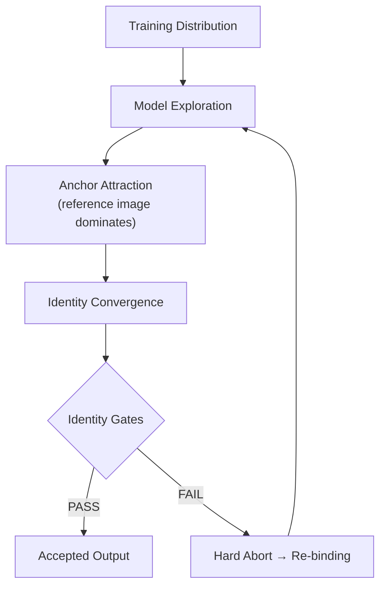
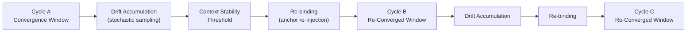
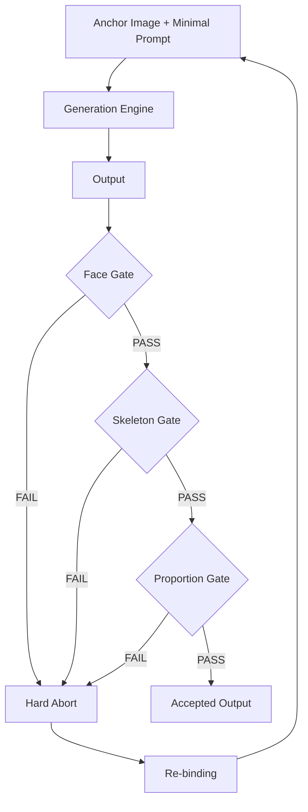
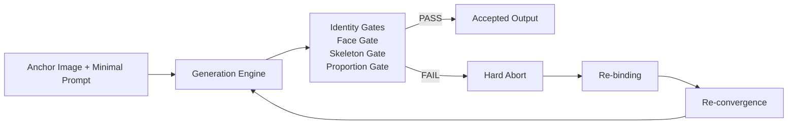
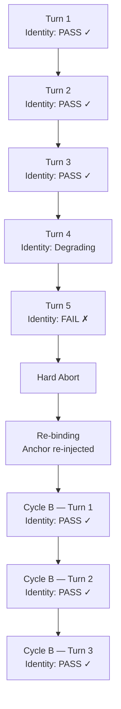

# Architecture Diagram — Character Identity Protocol

This document provides visual representations of CIP’s three core mechanisms:
Anchor Attractor, Cycle Stabilization, and Identity Gates.

> All diagrams are operational abstractions. They do not represent proprietary model internals.

-----

## 1. Anchor Attractor Model

*How the anchor guides the model toward a stable identity state.*



**Key insight:**  
The anchor does not bypass model optimization.  
It introduces a previously validated solution state that attracts reconstruction toward a known stable region.  
The model optimizes toward that prior rather than reconstructing freely.

-----

## 2. Cycle Stabilization Model

*How identity stability is maintained across multiple generation cycles.*



**Key insight:**  
Stability is not permanent.  
It is chained through disciplined re-convergence cycles.

```
[ Stable State A ]
        ↓
  Drift Accumulation
        ↓
  [ Re-Convergence ]
        ↓
[ Stable State B ]
        ↓
  Drift Accumulation
        ↓
  [ Re-Convergence ]
        ↓
[ Stable State C ]
```

-----

## 3. Identity Gates — Operational Control Flow

*How generation outputs are accepted or rejected.*



**Gate policy:**

```
PASS ⇔ Face Gate ∧ Skeleton Gate ∧ Proportion Gate
```

All gates must pass. Any single failure triggers Hard Abort.

> The ≈90% threshold refers to human-judged identity similarity relative to the anchor — not an automated metric.

-----

## 4. Full CIP Operational Architecture

*The complete control loop.*



-----

## 5. Generation Pipeline — Without vs. With CIP

**Without CIP:**

```
User Prompt
      ↓
┌─────────────────────┐
│  Language Layer      │  Language interpretation
└─────────┬───────────┘
          ↓
┌─────────────────────┐
│  Reconstruction      │  ← Unconstrained
│  A → A'              │  Identity drift emerges here
└─────────┬───────────┘
          ↓
     Output (A')
     (Identity: uncontrolled)
```

**With CIP:**

```
Minimal Prompt  +  Anchor Image ──────────────┐
      ↓                                        │
┌─────────────────────┐                        │
│  Language Layer      │  Reduced load          │
│  (minimal prompt)    │  (fewer constraints)   │
└─────────┬───────────┘                        │
          ↓                                    ↓
┌─────────────────────────────────────────────┐
│  Reconstruction A → A'                       │
│  Anchor guides reconstruction                │  ← Operationally constrained
│  toward a previously converged solution state│
└─────────┬───────────────────────────────────┘
          ↓
     Output converges toward Anchor
          ↓
     Identity Gates (PASS / FAIL)
          ↓
   PASS → Production
   FAIL → Hard Abort → Re-binding
```

**Clarification:**  
Language Layer / Reconstruction / Execution are conceptual abstractions for explanatory purposes. They do not imply knowledge of proprietary model internals.

-----

## 6. Identity Drift Timeline

*How identity similarity degrades over turns and how CIP intervenes.*



**Key insight:**  
Identity similarity is not maintained indefinitely.  
It degrades gradually through stochastic drift.  
CIP detects failure at the gate level and immediately re-binds the anchor.

```
High  ┤  ████ ████ ████ ░░░░
      │
      │                      FAIL
Low   ┤                        │
      │                        ↓
      │                  Hard Abort
      │                        ↓
High  ┤                  Re-binding
      │                        │
      │              ████ ████ ████ ░░░░
      └─────────────────────────────────→ Turns
           Cycle A             Cycle B
```

-----

## Operational Summary

|Element       |Role                                                 |
|--------------|-----------------------------------------------------|
|Anchor Image  |Primary convergence attractor                        |
|Minimal Prompt|Auxiliary identity constraint                        |
|Identity Gates|Operational validation (Face ∧ Skeleton ∧ Proportion)|
|Hard Abort    |Drift containment — immediate termination            |
|Re-binding    |Anchor re-injection to restart convergence           |
|Cycle         |Bounded convergence window                           |


> CIP does not control the model.  
> It controls the conditions under which the model converges.

-----

*See: [Technical Mechanism](technical_mechanism.md) for theoretical framing.*  
*See: [Quality Gate Addendum](quality_gate_addendum.md) for gate definitions.*