# Character Drift Taxonomy

> This document is observational and technical in nature.
> Statements about generative model behavior are based on operational practice rather than controlled laboratory measurement.

-----

Generative image models often fail to reproduce the same character consistently.
Even when prompts remain identical, generated characters may change across generations.

This phenomenon can be understood as **character drift**.

This document provides a taxonomy of common drift types observed in practice and explains their underlying statistical causes.

The observations described here focus on character-centric image generation workflows.

-----

## Drift Types

### 1. Identity Drift

Identity Drift occurs when a generated character becomes a different individual despite identical prompts.

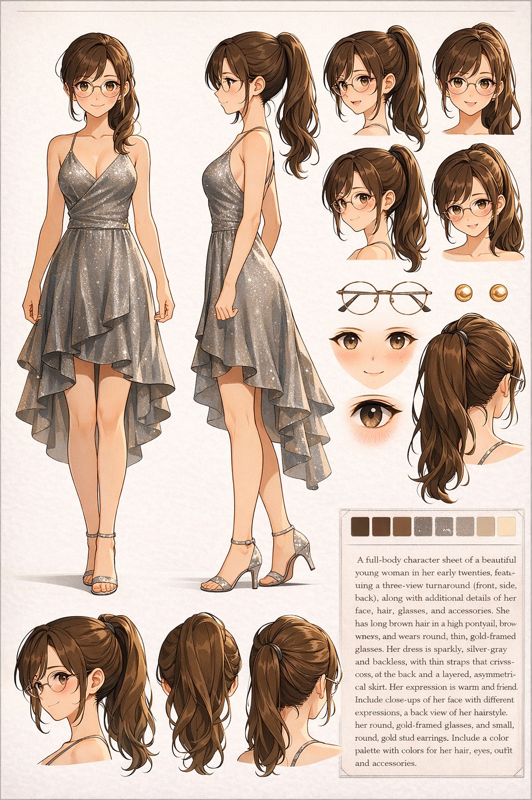 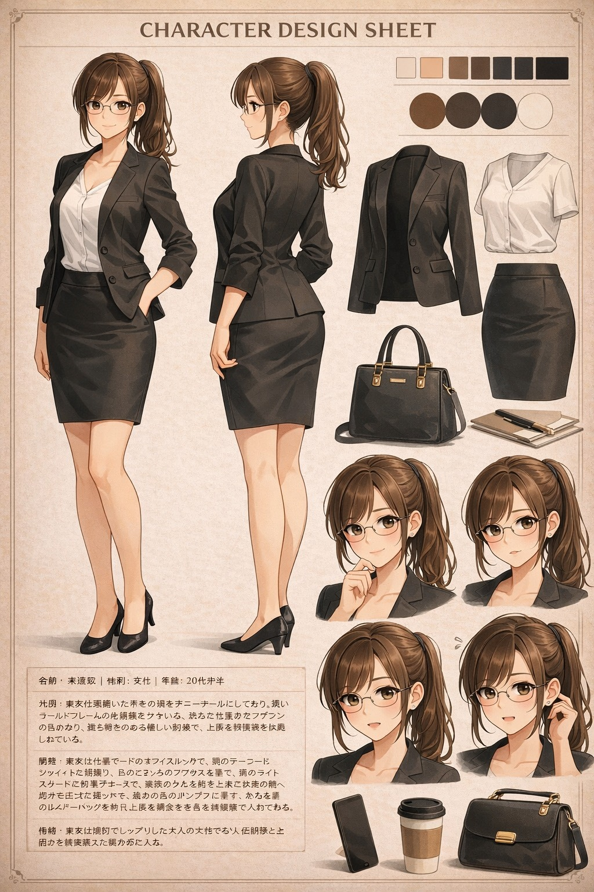

*The visual identity of the character changes even though the prompt remains constant.*

-----

### 2. Age Drift

Age Drift occurs when the perceived age of a character changes because contextual cues such as clothing or pose activate different statistical associations in the training distribution.

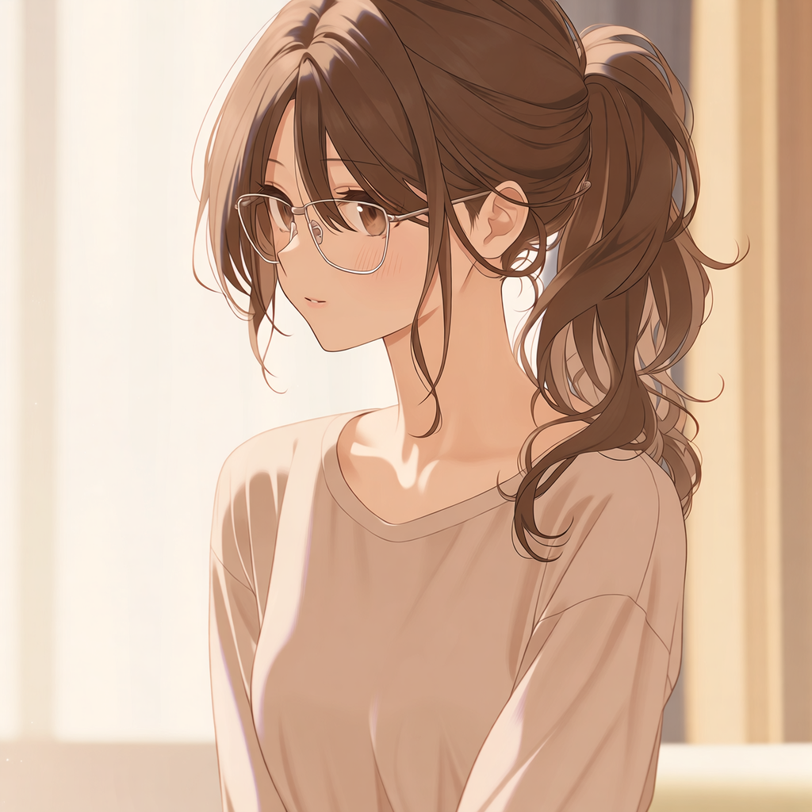 

*Clothing and expression may shift the statistical interpretation of age.*

-----

### 3. Eye Color Drift

Eye Color Drift occurs when eye color varies across generations because color attributes are represented as probabilistic clusters rather than discrete values.

 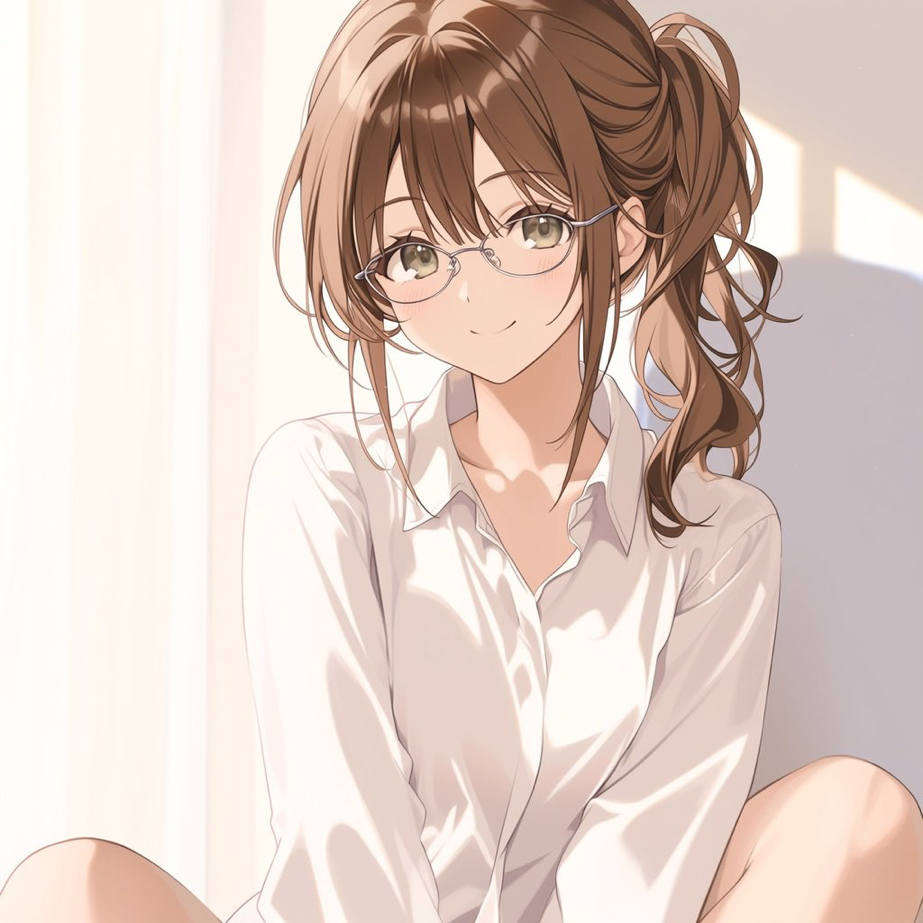

*Color categories such as brown, amber, and hazel often exist within the same statistical cluster.*

-----

### 4. Proportion Drift

Proportion Drift occurs when skeletal proportions change because body geometry is inferred from statistical body-type clusters rather than fixed parameters.

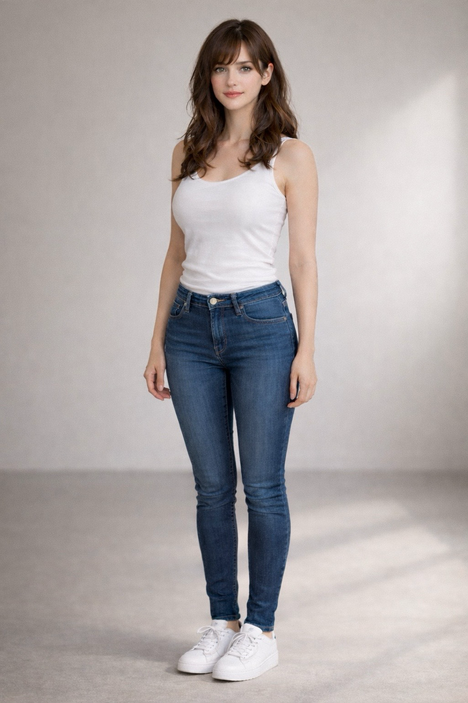 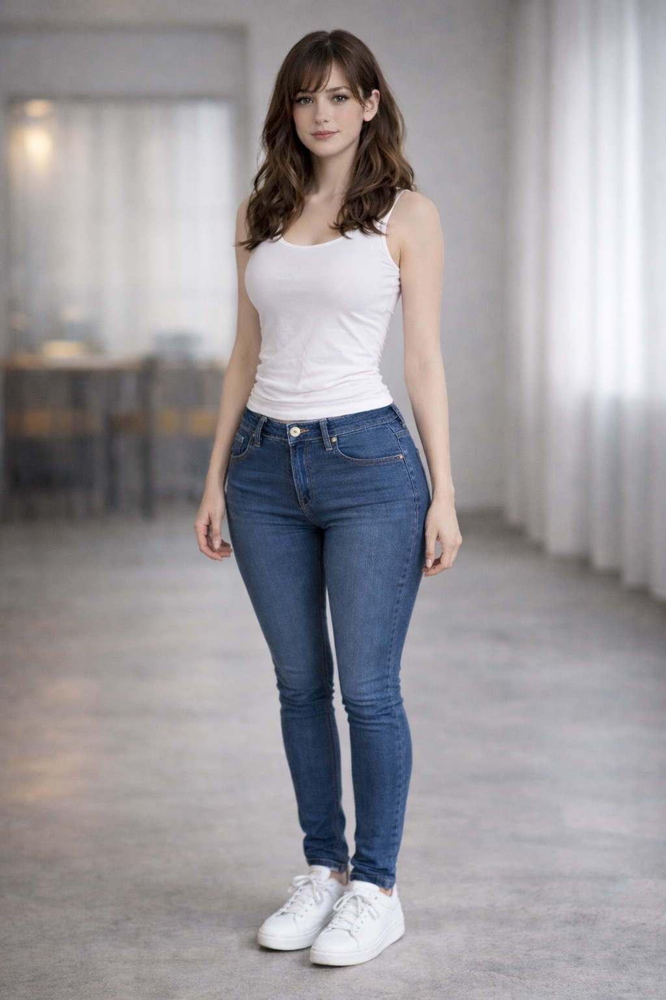

*Body geometry is not fixed and may converge toward different body-type clusters.*

-----

### 5. Style Drift

Style Drift occurs when rendering shifts toward a different visual style, often because models regress toward higher-density stylistic regions such as photorealism.

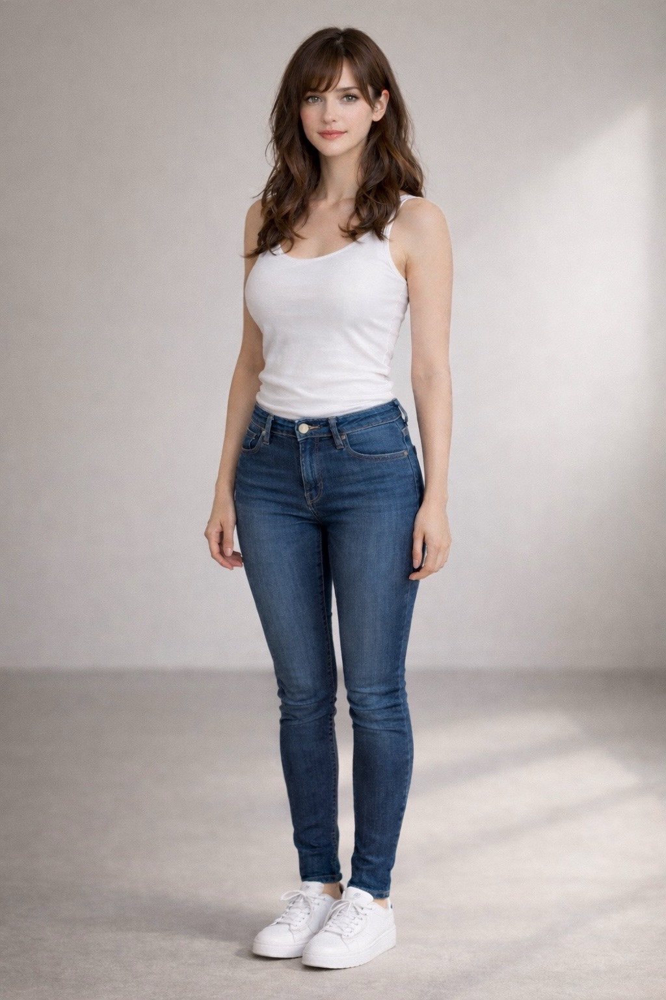 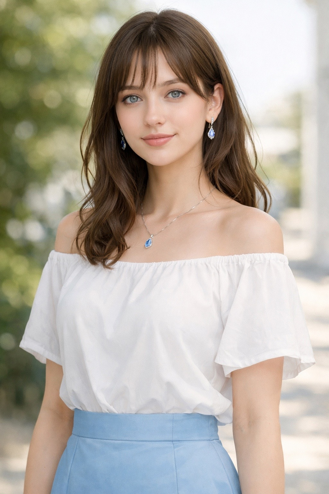

*Photographic imagery typically dominates training distributions, making stylistic regression common.*

-----

### 6. Background Drift

Background Drift occurs when environmental context changes because background elements are weak constraints compared to the primary subject.

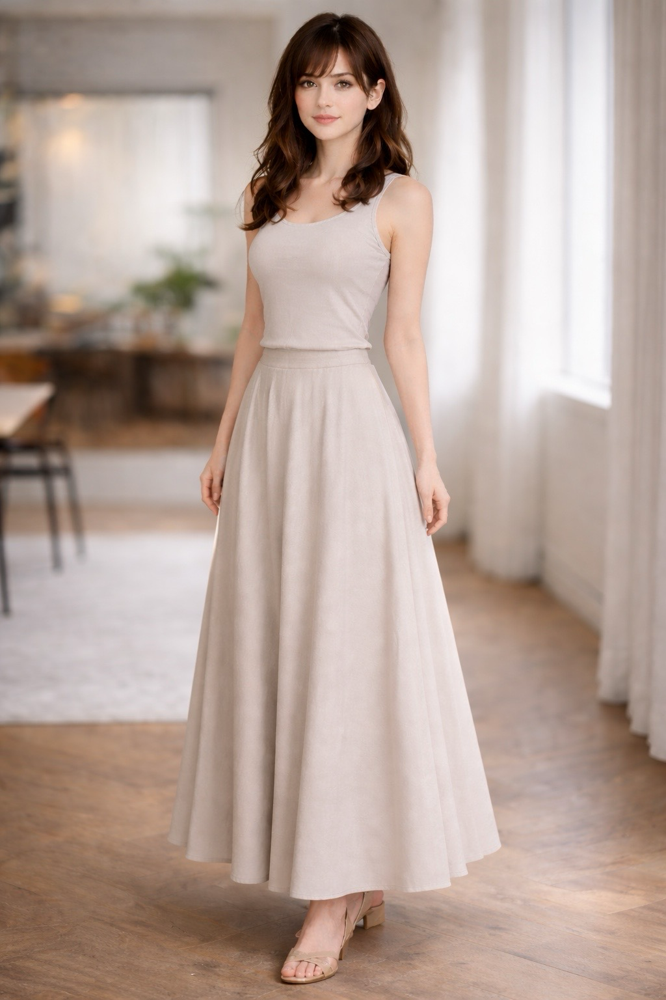 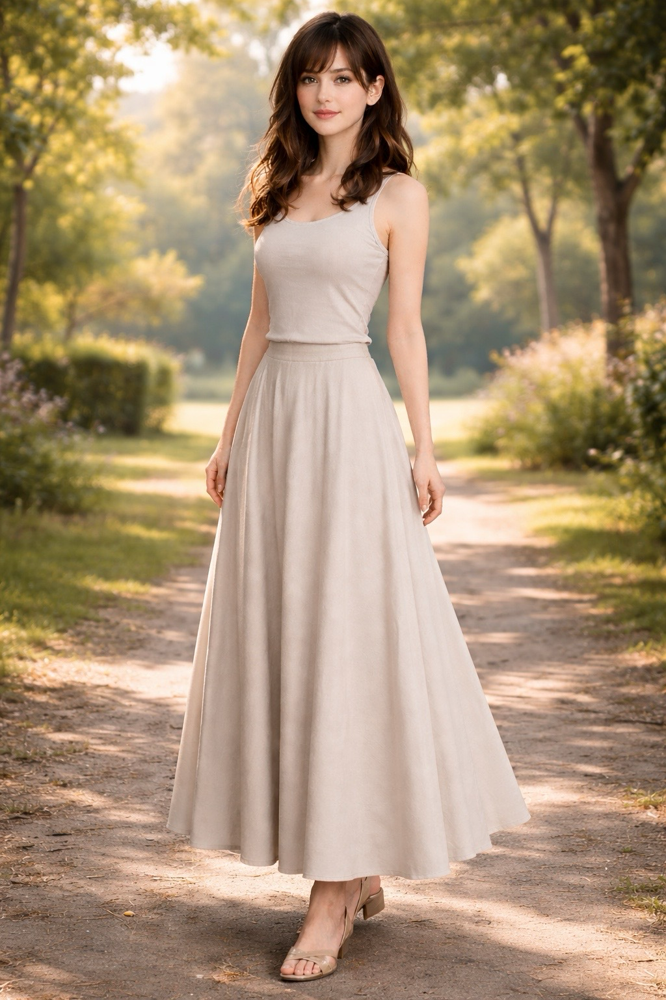

*Backgrounds are often treated as secondary context and therefore change easily.*

-----

### 7. Rendering Collapse

Rendering Collapse occurs when structural coherence breaks down during image reconstruction, producing distorted anatomy or unstable geometry.

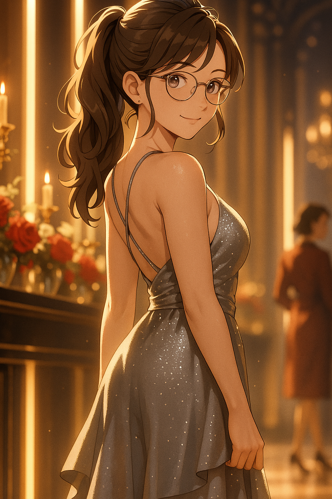 

*Certain structures such as hands, glasses, or background figures are particularly unstable.*

-----

### 8. Attribute Drift

Attribute Drift occurs when a character attribute gradually disappears from the prompt and the model regresses toward a default representation from the training distribution.

**Example:** long legs → attribute omitted over turns → short-leg default reconstruction

This form of drift is particularly subtle because it accumulates silently as prompts are simplified over time.

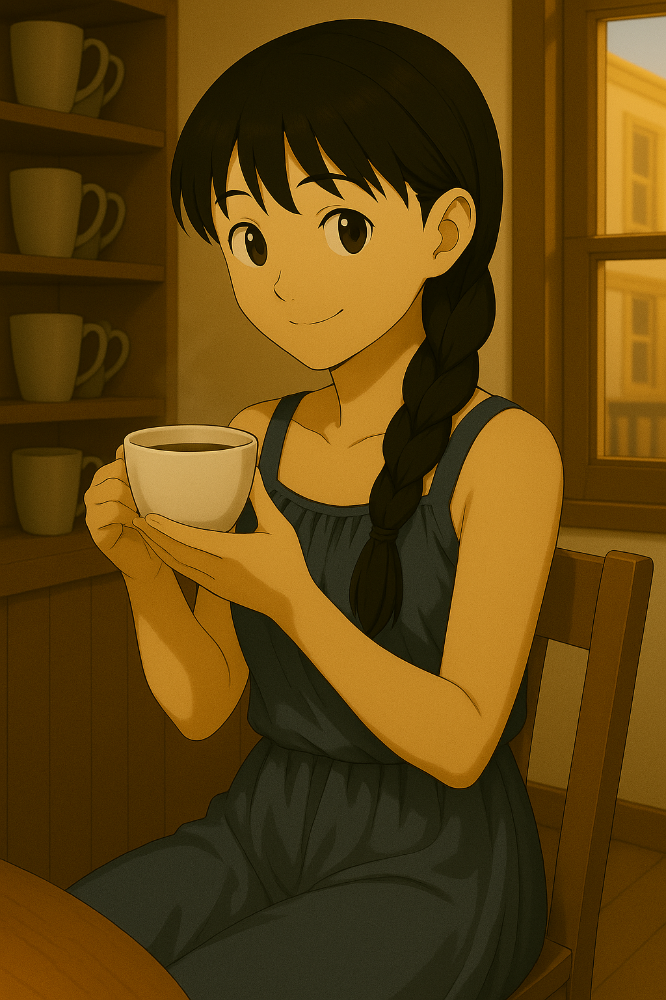 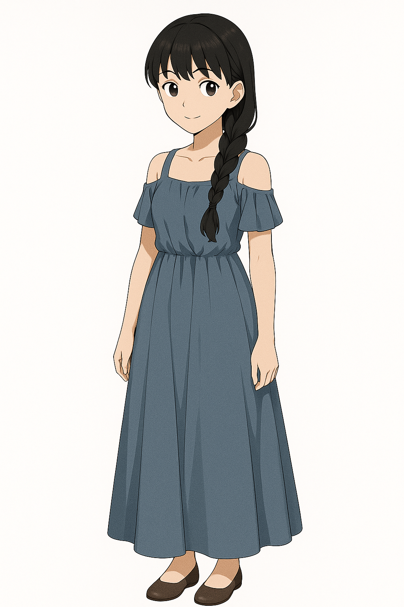

*A character attribute present in early generations gradually disappears as prompts are simplified, and the model reverts to a default representation.*

-----

### 9. Angle Drift

Angle Drift occurs when the model abandons the intended camera angle due to structural constraints or pose complexity.

When the requested composition becomes statistically unstable, the model may revert to a more common camera framing.

This often appears as:

- loss of intended camera angle
- unintended framing
- sudden composition change

In some cases, the transition frame may produce a visually striking result — often described by artists as a “miracle shot.”

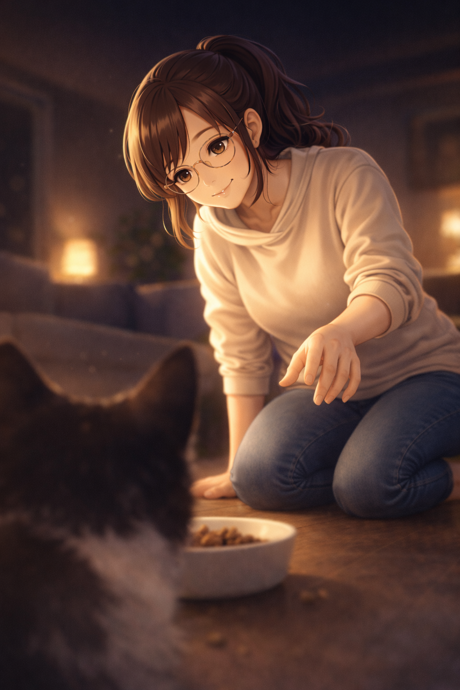 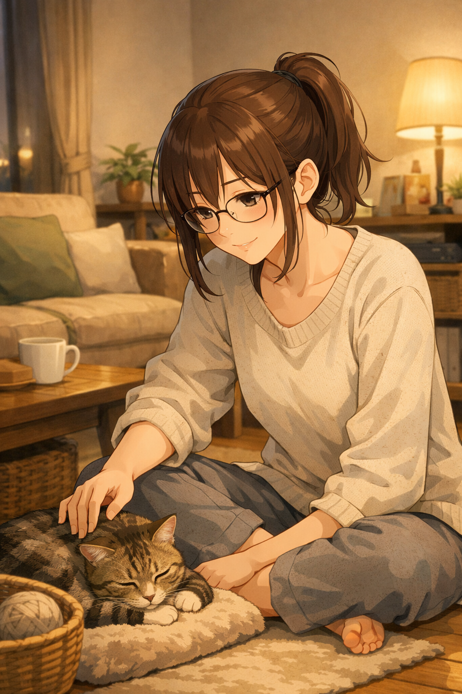

*The intended camera angle collapses into a more common and statistically stable framing.*

-----

### 10. Archetype Drift

Archetype Drift occurs when a generated character retains partial
visual continuity with the anchor identity while shifting toward
a stronger nearby archetype in the model’s reconstruction space.

Unlike facial collapse or structural degradation, Archetype Drift
is a directional failure: visual features remain substantially
intact, but the identity interpretation consistency — the social
register, personality impression, and role identity — shifts
toward a more dominant nearby template.

This is captured by the phrase: **same face, different person.**

Archetype Drift is particularly difficult to detect because:

- Structural gates (Face, Skeleton, Proportion) may all pass
- The drift accumulates gradually across turns or sessions
- Individual outputs may appear acceptable in isolation

Detection requires evaluation at the identity register level —
assessing social impression, expressive register, and role
identity consistency against the anchor UID definition.

Archetype Drift is especially significant in multi-scene,
multi-session, and video generation workflows.

*See: [White Paper — Section 2.3.8](whitepaper_v1.md) — [Glossary — Archetype Drift](glossary.md)*

-----

## Taxonomy

The following taxonomy summarizes common forms of character drift observed in generative image workflows.

### Core Drift (Image Generation)

```
Character Drift
│
├─ Identity Drift
├─ Age Drift
├─ Eye Color Drift
├─ Proportion Drift
├─ Style Drift
├─ Background Drift
├─ Rendering Collapse
├─ Attribute Drift
├─ Angle Drift
└─ Archetype Drift  — identity register shifts toward dominant nearby archetype
```

### Behavioral Drift (Generation Behavior)

```
Behavioral Drift
│
├─ Fixation Drift       — model locks onto a recurring visual pattern and resists prompt updates
├─ Context Drift        — identity changes as session context shifts
└─ Prompt Compression Drift — attributes omitted over turns regress to defaults
```

### Cross-System Drift (Broader AI Systems)

```
Cross-System Drift
│
├─ Semantic Drift       — meaning of prompt shifts across platforms or sessions
├─ Temporal Drift       — identity degrades over extended generation cycles
└─ Constraint Drift     — operational constraints erode over iterative use
```

Most forms of character drift occur when generation shifts toward high-density regions of the training distribution.

-----

## Training Distribution Density

Most forms of generative drift are not random failures.
They occur when the model regresses toward high-density regions of the training distribution.

Generative models reconstruct images from learned statistical distributions.

When the generation process becomes uncertain, the model tends to shift toward regions of the distribution where training examples are dense.

These high-density regions represent the model’s statistical “common sense.”

As a result, unusual prompts or unstable conditions often lead the generation back toward more common visual patterns.

This statistical regression explains many forms of character drift observed in generative image systems.

In practice, this means that unstable generations often converge toward visually common patterns present in the training data.

-----

## Core Observation

> Generative models are most stable in high-density regions of the training distribution.
> When generation becomes uncertain, outputs tend to regress toward those regions.

This statistical tendency explains many forms of character drift.

-----

*See also: [Identity Drift in Generative Image Models](column_identity_drift_practical.md) — [Character Identity Drift in Generative AI](column_identity_drift.md) — [White Paper](whitepaper_v1.md) — [Appendix: Observed Drift Phenomena](drift_observations.md)*