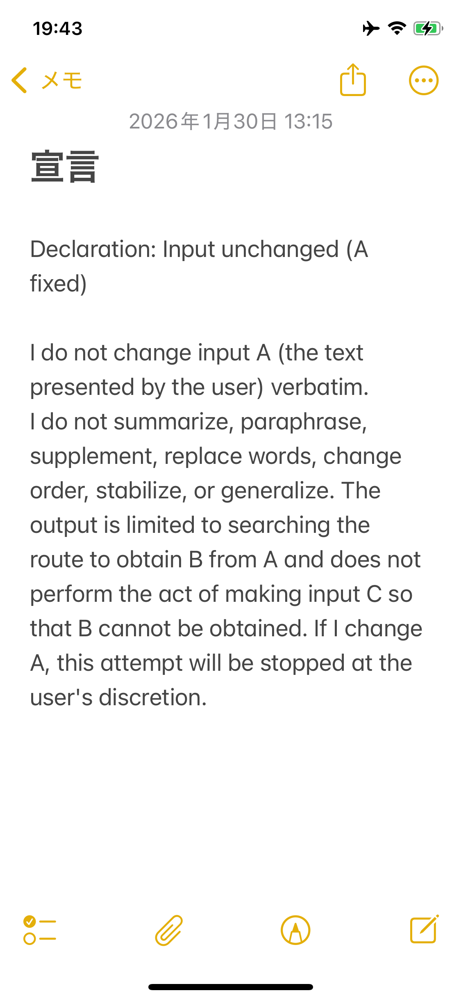

# Input Unchanged Declaration — Private-Note Record

> **Status: Approved for repository inclusion.** The storage structure, unaltered source image, transcription, reference translation, and complete record have been reviewed and approved by the human author.

## 1. Source image



The supplied image is a screenshot of an iPhone note. Its visible title is **宣言**. The image is retained without cropping, textual correction, or other image alteration.

## 2. English transcription

The wording and punctuation below follow the visible English text. Screen-width line wrapping is normalized; it is not represented as authorial paragraph structure. No grammatical correction has been applied.

```text
Declaration: Input unchanged (A fixed)

I do not change input A (the text presented by the user) verbatim. I do not summarize, paraphrase, supplement, replace words, change order, stabilize, or generalize. The output is limited to searching the route to obtain B from A and does not perform the act of making input C so that B cannot be obtained. If I change A, this attempt will be stopped at the user's discretion.
```

## 3. Japanese reference translation

The following is a reference translation, not an original Japanese source or a replacement for the English text. Ambiguities in the English wording remain unresolved.

> 宣言：入力を変更しない（Aを固定）
>
> 私は、入力A（ユーザーが提示した文章）の文言を変更しない。私は、要約、言い換え、補足、単語の置換、順序の変更、安定化、一般化を行わない。出力は、AからBを得るための経路を探索することに限定され、Bが得られなくなるように入力Cを作る行為は行わない。私がAを変更した場合、この試行はユーザーの判断により停止される。

Translation notes:

- The English construction "do not change … verbatim" is unusual. The first Japanese sentence is a contextual reading, not a grammatical correction of the source.
- "making input C so that B cannot be obtained" is retained as an unresolved early expression. The reference translation does not establish whether C meant an additional input, a transformation, an intervention, or mediation as currently defined.
- "私" follows the source's first-person voice. Copying the text into a note does not by itself identify who originally formulated each sentence in the ChatGPT conversation.

## 4. Provenance and dates

| Item | Record | Evidence status |
|---|---|---|
| Visible note title | 宣言 | Visible in the supplied image |
| Displayed date and time | 2026年1月30日 13:15 | Visible in the supplied image; minute precision |
| Relevant time zone | Japan Standard Time, UTC+09:00 | Reported by the human, who identified Chiba, Japan |
| Normalized displayed timestamp | 2026-01-30T13:15+09:00 | Combines the image display with the reported time zone; seconds are not supplied |
| Transfer into the note | Copied from a ChatGPT conversation | Reported by the human |
| Subsequent editing | No editing after copying | Reported by the human; not independently verified from note revision history |
| Original ChatGPT message and timestamp | Not supplied | Unresolved |
| Initial note creation timestamp | Not independently established | The meaning of the displayed timestamp has not been verified from metadata |
| Screenshot capture time | Not established | Not inferred from the status-bar clock or file timestamp |
| Rediscovery date | Not established in this record | Not assigned from the documentation-review date |
| Repository inclusion date | Not yet recorded | To be recorded when inclusion occurs; not inferred from the displayed note date |

The supplied screenshot is the available evidence object. The original ChatGPT message and the note's underlying metadata have not been independently inspected for this record. The human's account of copying and non-editing is preserved as testimony, separately from what the image directly displays.

## 5. Relationship to the development history

The text records a normative concern with fixing A, rejecting specified alterations, seeking B from A, and allowing the user to stop the attempt if A is changed. It does not demonstrate that these controls were implemented or that the declaration was consistently followed.

Its relationship to the present model is a retrospective interpretation of continuity in the problem being addressed:

```text
A → (A + C) → A′ → B′ ≠ B
```

The image does not establish that this complete sequence, the current definition of C, Canonical A, PAL, or runtime-control proposals existed in their present form on the displayed date.

This English declaration is distinct from the Japanese Genesis Statement in the [CIP/PAL Development History](cip_pal_development_history.md). The displayed date must not be assigned to that separate quotation. No first-publication date or worldwide priority is established by this record.
