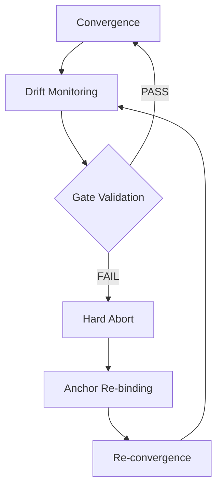
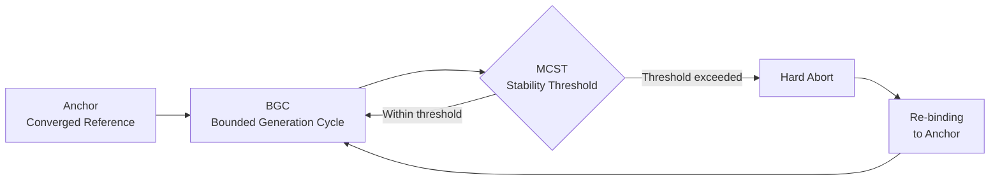

# White Paper: Character Identity Protocol (CIP) v1.0

**A Governance Framework for Identity Convergence and Cross-Platform Portability in Generative Systems**

> This white paper reflects operational observations and validated production workflows.
> It does not claim deterministic reproduction or internal model access.

-----

## 1. Executive Summary

The primary challenge in deploying generative AI for creative and corporate workflows is **Identity Drift** — the loss of visual and behavioral consistency across generation turns, sessions, and platforms.

Conventional trial-and-error prompting lacks reproducibility and risks **Identity Loss** during model updates or session terminations.

The Character Identity Protocol (CIP) defines character identity not as a random output, but as a statistical convergence point within the model’s reconstruction space. Through the Anchor Mechanism, the protocol enables the protection, recovery, and cross-platform portability of character identities.

CIP reframes character identity from a static output property to a recoverable convergence state within the model’s reconstruction space — one that must be repeatedly recovered under operational constraints.

In style-defined identity domains (e.g., anime and franchise animation), rendering regime stability constitutes part of identity and is enforced under the same Identity Gate discipline.

-----

## 2. Theoretical Foundation: Convergence Behavior

### Definition: Character Identity

**Character identity** is the minimum structural and perceptual invariance required for a domain-competent observer to continuously judge successive reconstructions as the same character under production conditions.

> *Operational note: Identity is governed through explicit validation constraints — gate criteria, threshold enforcement, and Hard Abort discipline — not asserted by descriptive claim alone.*

-----

### The “Miracle Image” Phenomenon

High-purity outputs that emerge within the latent space may represent transient solution states rather than random accidents.

These frames exhibit unusually high coherence — disproportionately finished relative to surrounding outputs. They represent transient local optima where user constraints and model priors align with unusual precision.

*See: [Miracle Images and Convergence Behavior](column_miracle_image.md) — [Character Identity Drift in Generative AI](column_identity_drift.md)*

### Controlled Convergence

A methodology to narrow the probability density of generation, directing the AI to converge on a specific identity space rather than diverging into variations.

The convergence point is not forced — it is biased. The anchor introduces a previously validated solution state that guides reconstruction toward a known stable region.

### Minimal Prompt Principle

Minimizing optimization pressure from the model’s training priors by reducing prompt surface area.

Verbose prompts activate interpretation and optimization layers, causing the model to “improve” input away from the intended state. Minimal prompts reduce this pressure, preserving convergence fidelity.

*See: [Technical Mechanism](technical_mechanism.md)*

### Max Context Stability Threshold (MCST)

In probabilistic generative systems, identity stability exists within a bounded convergence window.
Beyond a certain accumulation of probabilistic drift, reconstruction reliability degrades.

This boundary is defined as:

**Max Context Stability Threshold (MCST)**

MCST represents the operational upper bound of stable identity reconstruction within a single context-bound generation window.
It is not a fixed numeric constant.

Observed empirical ranges (e.g., ~40 turns in certain interfaces) are implementation-dependent and should be treated as indicative rather than prescriptive.

MCST varies depending on:

- Model architecture
- Context window size
- Sampling configuration
- Prompt entropy
- Output conditioning strength

CIP does not depend on a fixed turn count.
It operates by detecting and respecting the MCST boundary within any given system.

-----

-----

## 2.6 Identity Drift Taxonomy

Generative systems exhibit multiple modes of identity drift during iterative reconstruction.
Understanding these drift modes is critical for operational governance, as different failure modes require different mitigation responses.

CIP defines identity drift not as a single phenomenon but as a taxonomy of reconstruction deviations relative to the anchor state.

The following categories represent the most commonly observed drift modes in production workflows.

### 2.6.1 Facial Identity Drift

**Definition**

Deviation in facial structure or facial feature configuration relative to the anchor identity.

Typical manifestations:

- Eye shape or spacing changes
- Jawline or cheekbone structure shifts
- Nose bridge or mouth proportion changes
- Age appearance drift

**Operational impact**

Facial drift typically results in immediate identity loss, even when body structure and style remain stable.
For this reason, CIP assigns highest priority to Face Gate validation.

### 2.6.2 Skeletal Drift

**Definition**

Changes in the underlying body structure or pose skeleton that alter the physical plausibility of the character relative to the anchor.

Typical manifestations:

- Shoulder width changes
- Limb length variation
- Pose articulation inconsistencies
- Spine or hip alignment changes

**Operational impact**

Skeletal drift may not immediately break facial recognition but gradually destabilizes identity perception over multiple turns.
CIP detects this failure mode through Skeleton Gate validation.

### 2.6.3 Proportion Drift

**Definition**

Deviation in global body proportions relative to the anchor reference.

Typical manifestations:

- Head-to-body ratio changes
- Torso-to-leg ratio variation
- Bust or hip proportion shifts
- Overall silhouette imbalance

**Operational impact**

Proportion drift often accumulates slowly across turns and may initially appear acceptable.
However, once deviation exceeds perceptual thresholds, the character becomes visually distinct from the anchor identity.
This drift mode is governed by the Proportion Gate.

### 2.6.4 Rendering Regime Drift

**Definition**

Deviation in the rendering regime or stylistic representation of the character.

Typical manifestations:

- Line art thickness variation
- Lighting regime shifts
- Color palette deviation
- Transition between stylized and semi-realistic regimes

**Operational impact**

In style-defined identity domains (e.g., anime or franchise animation), rendering regime stability forms part of the character identity.
Significant regime drift can break identity continuity even when structural features remain consistent.
CIP therefore treats rendering regime stability as part of identity validation under the same gate discipline.

### 2.6.5 Contextual Drift

**Definition**

Gradual identity degradation caused by accumulated contextual influence across generation turns.

Typical manifestations:

- Progressive pose reinterpretation
- Style blending from prior outputs
- Feature averaging across generations
- Entropic divergence from the anchor reference

**Operational impact**

Contextual drift is strongly correlated with context length and sampling entropy.
This phenomenon motivates the concept of Max Context Stability Threshold (MCST) and the use of bounded generation cycles (BGC).

### 2.6.6 Drift Interaction

Drift modes rarely occur in isolation.
In production environments, multiple drift categories often interact simultaneously.

For example:

```
Contextual Drift
        ↓
Skeletal Drift
        ↓
Facial Drift
        ↓
Identity Loss
```

This cascading failure pattern is one of the primary reasons CIP enforces Hard Abort discipline rather than progressive correction.

Once multiple drift modes interact, recovery through incremental prompt adjustments becomes unreliable.
CIP mandates termination of the contaminated cycle and re-binding to the last verified anchor state.

### 2.6.7 Operational Implications

The drift taxonomy reinforces several core design principles of the CIP protocol:

- Identity stability is multi-dimensional, not a single similarity score
- Drift modes must be evaluated independently through identity gates
- Progressive correction is unreliable once drift cascades begin
- Recovery must therefore rely on anchor re-binding and controlled re-convergence

This taxonomy provides a conceptual framework for understanding why identity governance requires structured operational control rather than purely prompt-based optimization.

-----

## 3. Core Implementation: The Anchor Mechanism

The protocol utilizes three pillars to lock identity:

**1. Anchor Image**  
The highest-purity reference image serving as the ground truth for convergence.  
Not a reference or inspiration — a previously achieved solution state that the model is directed to recover.

**2. Minimal Prompt**  
Reducing descriptive noise to maximize the model’s focus on the anchor.  
Factual attributes only. No adjectives, no mood descriptors, no subjective terms.

**3. Unique Identifier (UID)**  
Assigning a stable linguistic token (UID) that refers to the converged identity state across sessions and prompts.
Reduces cognitive and computational load in future sessions. Enables cross-session continuity without re-providing the full anchor each time.

-----

## 4. Advanced Application: Cross-Platform Migration

### 4.1 The “Lost Character” Problem

Identities often become lost due to:

- Model architecture shifts (e.g., Stable Diffusion → DALL-E 3)
- Session context expiration
- Prompt drift across iterations

The original prompt no longer yields the same result. Increasing detail makes it worse, not better.

### 4.2 Solution: Recovery Framing

**From “Recreation” to “Recovery”**

By framing the request as recovery of a lost entity, the operator shifts the AI’s optimization target.

- “Recreate” → generate something similar → variation is acceptable
- “Recover” → return to a specific prior state → convergence is required

This framing biases the model toward alignment with the provided visual anchor rather than interpreting the prompt freely.

**Validation**

Successfully demonstrated in migrating a lost Stable Diffusion character into GPT Image 1, achieving high-fidelity recall despite fundamental architecture differences.

*Full procedure documented in Case 04: Cross-Platform Migration (publication pending rights confirmation)*

-----

## 4b. A Representative Cross-Platform Production Pipeline

The following section describes one practical implementation path for CIP-governed character identity stabilization within the current generative AI ecosystem.

This configuration is not presented as universal or permanent. Tool availability, platform capabilities, and API policies evolve rapidly. The operational layers described here are intended to remain meaningful independent of any specific vendor combination.

A representative contemporary pipeline may be organized across five functional stages.

### Reference Generation

Reference generation is handled by systems optimized for visual diversity and aesthetic exploration (e.g., Midjourney). At this stage the initial character reference space is explored and candidate anchor images are identified.

This stage is not directly governed by CIP. Instead, it produces the candidate inputs from which anchors are later selected.

### Anchor Finalization

Anchor finalization is performed within composable or highly controllable generation environments (e.g., ComfyUI). In this stage candidate images may be conditioned, evaluated against skeletal and proportion constraints, and prepared as stable validated anchor inputs for downstream cycles.

### Sequential Scene Generation

Sequential scene generation is delegated to inference-capable generation systems that accept anchor references and minimal prompts as inputs (e.g., GPT Image 1.5 or Nano Banana).

This stage operates under full CIP governance. After each generation cycle, identity validation gates are applied. When drift is detected, recovery mechanisms such as hard-abort mechanisms may be triggered.

### Production Post-Processing

Production post-processing is handled by downstream creative tools (e.g., Adobe Photoshop, Adobe Firefly, or related production software). These tools operate outside the CIP generation loop, where identity has already been validated.

Typical tasks in this stage include retouching, compositing, and preparation for final output.

### Orchestration and Workflow Governance

Pipeline orchestration and workflow governance may be supported by agentic systems capable of coordinating tools and maintaining operational records (e.g., ChatGPT or Gemini with tool-use capabilities).

Such systems can coordinate across pipeline stages, trigger re-binding events when necessary, and maintain audit logs of identity gate outcomes.

### Architectural Implication

The lasting contribution of this architecture is not the specific vendor combination, which reflects present-day tool availability. Rather, it is the protocol layer itself.

CIP defines an operational structure for:

- anchor management
- identity validation
- hard-abort enforcement
- cross-platform re-convergence

This structure remains applicable even as individual tools are replaced, extended, or evolve over time.

-----

## 5. Governance and IP Management

### Brand Integrity

A standardized operational procedure (SOP) ensuring that any operator, on any system, can produce the same character.

Identity is defined by the anchor + minimal prompt combination — not by a specific model, platform, or session. This makes the character asset portable and vendor-independent.

### IP Portability

Decoupling intellectual property from specific AI vendors.

Character assets remain persistent and manageable even as underlying technologies evolve. The anchor mechanism functions as a platform-agnostic identity reference record.

### Operational Efficiency

Statistically reducing randomized generation attempts, thereby minimizing generation costs and human review time.

Production metrics observed across case studies:

*The following figures represent observational production-session averages and should not be interpreted as statistically validated benchmarks.*

|Metric                  |Without Protocol   |With Protocol       |
|------------------------|-------------------|--------------------|
|Identity preservation   |40–60% failure rate|<5% failure rate    |
|Wasted generations      |~50%               |<5%                 |
|Cross-platform migration|Trial and error    |Systematic procedure|

*Measurement notes: Observational estimates based on production sessions documented in case studies 01–07. “Failure” = human-judged identity gate failure (Face Gate or Skeleton Gate or Proportion Gate). No automated measurement was used. Platform: ChatGPT (GPT Image 1) unless otherwise noted. These are provisional figures; systematic cross-platform measurement has not been conducted.*

### Measurement Disclosure

All percentage-based thresholds reported in this document are observational governance thresholds established through production workflow monitoring. They are not claims about internal model architecture, deterministic output guarantees, or statistically validated benchmarks.

Match rate assessment in the reported case studies was human-judged; no automated similarity metric was used in those measurements. CIP itself permits quantitative verification layers, but they are presented as optional implementations and non-prescriptive examples in this document.

### Identity Gates Integration

Production deployment requires formal stop-conditions.

Identity gates (Face Gate ∧ Skeleton Gate ∧ Proportion Gate) must all pass simultaneously. Any failure triggers immediate session termination — not progressive correction.

*See: [Identity Gates (Quality Gate Addendum)](quality_gate_addendum.md)*

### Human-First Validation (ISO-Style Explainability)

Operators often recognize identity coherence instantly — a holistic perceptual judgment that precedes analytical breakdown.

Explanatory reasoning follows: proportion integrity, style coherence across face and body, age drift, exposure drift, and rendering regime deviation. This post-hoc articulation is not a weakness. It reflects trained operator perception operating ahead of metric decomposition.

CIP treats quantitative metrics as verification and audit trace — not as the primary judge.

**Decision rule:**
Human PASS → Metric verification
Human PASS ∧ Metric PASS → Identity confirmed.

This dual-pass structure avoids both failure modes: AI-only judgment (high automation risk) and human-only judgment (non-scalable, person-dependent). The human gate is first; the metric gate is the audit record.

This design is consistent with ISO-aligned governance frameworks, where human authority and documented evidence coexist.

In practice, operators frequently recognize identity convergence instantly — a moment often described as “this is it.” Detailed reasoning follows afterwards: proportion integrity, silhouette balance, face/body style coherence, and rendering regime stability.

CIP formalizes this operational reality. Holistic recognition triggers inspection; inspection produces the documented explanation required for governance.

Quantitative gates may be automated in future implementations, but CIP assigns final authority to the human gate under production risk.

### Illustrative Quantitative Gate Example (Non-Prescriptive)

CIP defines Identity Gates structurally.
However, implementations may operationalize gates using quantitative measures.

Illustrative examples:

**Face Gate:**

- Feature embedding cosine similarity ≥ 0.85 relative to anchor reference.

**Skeleton Gate:**

- Keypoint deviation within predefined tolerance band.

**Proportion Gate:**

- Ratio deviation below defined variance threshold.

These values are examples only.
CIP does not mandate specific numeric thresholds.
Threshold calibration must be system-specific and validated empirically.

The purpose of quantitative gating is not aesthetic evaluation,
but objective governance enforcement.

### Anchor Re-binding Procedure

When an Identity Gate failure occurs, CIP mandates immediate Hard Abort.

Following abort, recovery must proceed through structured re-binding:

1. Roll back to the last verified Converged Anchor.
1. Reset contextual accumulation (environment reset).
1. Re-inject the anchor as the primary reconstruction stabilizer.
1. Reset sampling configuration if applicable (temperature, seed, guidance scale).
1. Resume generation under full Gate enforcement.

This prevents probabilistic noise propagation and ensures that drift does not compound across cycles.

Re-binding is not an optional optimization.
It is a governance requirement within the CIP framework.

-----

## Bounded Generation Cycles (BGC)

CIP stabilizes identity through bounded generation cycles (BGC), within which convergence is maintained and drift is actively contained.

A BGC consists of:

- Convergence phase
- Drift monitoring
- Gate validation
- Hard Abort (if triggered)
- Anchor Re-binding
- Re-convergence phase



Stability is therefore chained, not assumed infinite.

CIP does not pursue perpetual identity persistence.
It enforces disciplined stability chaining through structured re-convergence.

### Conceptual Relationship: MCST, Anchor, and BGC



> *MCST defines when a cycle must end. The Anchor enables re-entry. BGC is the governed interval between them.*

-----

## 6. Validation

The protocol has been validated across the following production case groups:

|Case  |Scenario                                                                                |Result                                                                     |
|------|----------------------------------------------------------------------------------------|---------------------------------------------------------------------------|
|**01**|**Baseline Failure → Recovery Cycle**                                                   |                                                                           |
|01A   |Baseline — no protocol                                                                  |Identity collapse confirmed                                                |
|01B   |Hard Abort, Re-binding, Re-convergence (production recovery cycle; demonstrated in Mira)|Full BGC cycle documented                                                  |
|02    |Wedding series, 4 emotional transitions                                                 |Identity maintained, 15 turns                                              |
|03    |Fashion production, skeletal control                                                    |Audit-ready consistency, 38 turns                                          |
|04    |Cross-platform migration (SD → ChatGPT)                                                 |High-fidelity recovery observed under anchor-governed re-binding conditions|
|05    |Minimal prompt emergence — no image anchor                                              |New consistent character emerged                                           |
|06    |Gemini replication — cross-platform validation                                          |High-consistency behavior observed under gate-governed conditions          |

*Full case documentation available in [Case Studies](case_01_failure_log.md)*

-----

## 7. Conclusion

> *“So she can find her way home.”*

In this sense, CIP is not a generation technique but a recovery protocol for identity persistence in probabilistic generative systems.

In the fluid and volatile landscape of generative AI, the Character Identity Protocol serves as a compass.

By combining statistical convergence with rigorous operational framing, CIP establishes a practical standard for the management and preservation of character identities in production AI workflows.

The protocol does not oppose the model’s optimization dynamics.  
It constrains outputs operationally.

-----

*Status: v1.0 — February 2026*  
*Repository: [Character Identity Protocol](/character-identity-protocol/)*

-----

## Appendices

- [Appendix A — Operational Terminology](whitepaper_appendices.md#appendix-a--operational-terminology)
- [Appendix B — Operational Characteristics of Modern Image Generation Systems](whitepaper_appendices.md#appendix-b--operational-characteristics-of-modern-image-generation-systems)