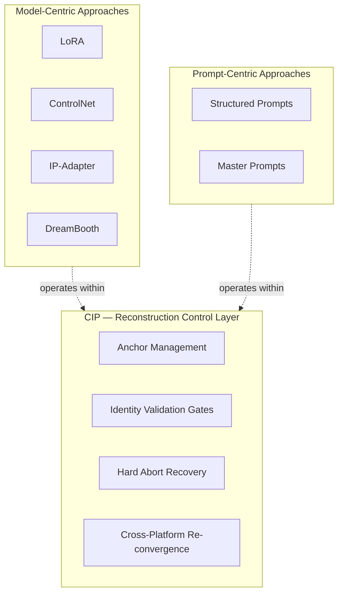
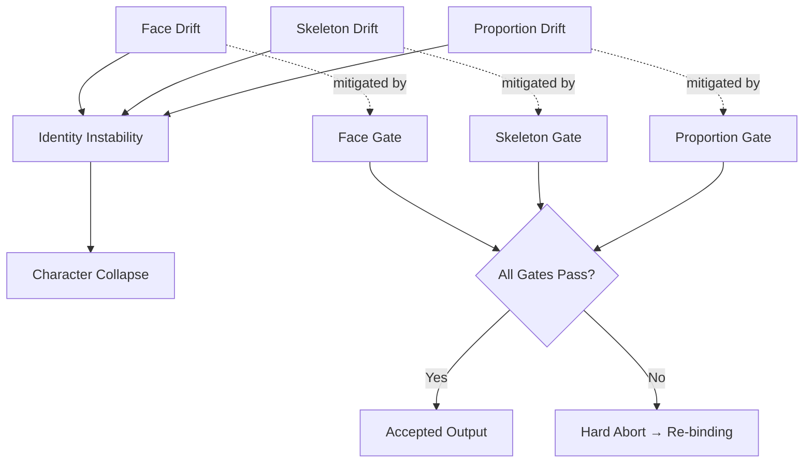
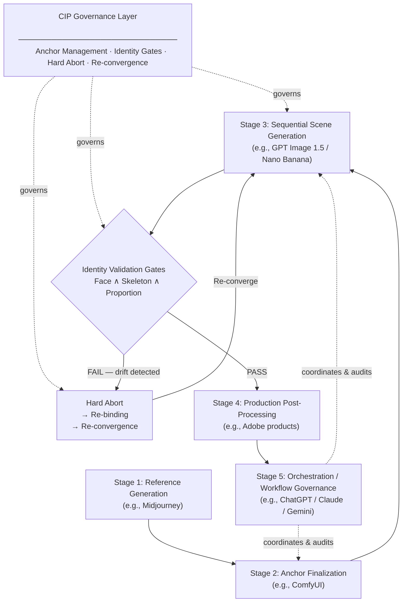
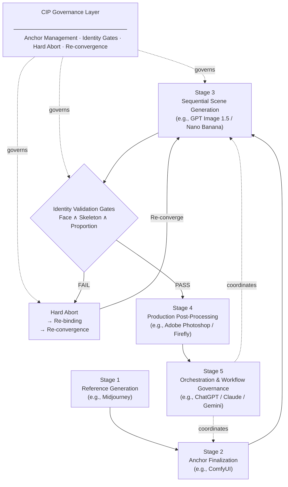
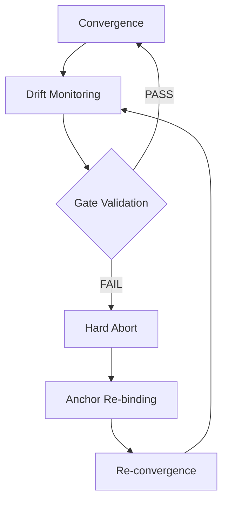
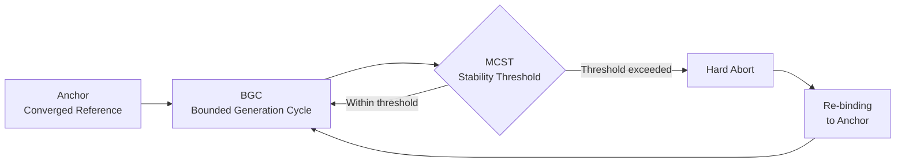
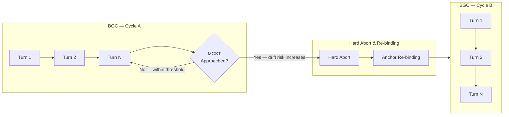

# White Paper: Character Identity Protocol (CIP) v1.0

**Inference-Time Control of Reconstruction for Identity Convergence in Generative Systems**

> This white paper reflects operational observations and validated production workflows.
> It does not claim deterministic reproduction or internal model access.

-----

> Identity continuity as an inference-time governance problem.

## Abstract

Generative image systems are inherently probabilistic: identical prompts may produce different outputs across generation cycles, and character identity may drift over sessions, platforms, and contexts. Existing approaches to character consistency — including model fine-tuning, prompt engineering, and reference conditioning — primarily operate at the level of model parameters or input specification, and do not explicitly control the reconstruction process that produces outputs during inference.

This paper introduces the Character Identity Protocol (CIP), an inference-time reconstruction control framework with governance mechanisms that formalizes identity stabilization as a control problem over the reconstructed state A′. In generative systems, user input A is not directly solved; it is first transformed into an internal reconstructed representation A′, which then produces output B′. CIP treats A′ as the controlled variable and constrains its evolution under probabilistic drift.

The protocol defines a closed-loop control architecture consisting of: anchor-based constraints that restrict the reconstruction space, minimal prompt design that reduces optimization pressure, identity validation gates (Face, Skeleton, Proportion), and Hard Abort mechanisms that terminate invalid reconstruction trajectories. Together, these components enforce bounded convergence of A′ within an anchor-constrained region.

CIP operates entirely at inference time, requires no model modification, and is compatible with closed-source systems. Validation across production workflows — including multi-turn generation and cross-platform identity recovery — demonstrates that identity consistency can be achieved by governing reconstruction dynamics rather than output similarity.

These results suggest that identity stability in generative systems is fundamentally an inference-time reconstruction control problem, and that governance of A′ provides a generalizable framework for improving reliability in probabilistic generative environments.

-----

## 1. Executive Summary

The primary engineering challenge in deploying generative AI for production workflows is **Identity Drift** — the systematic divergence of reconstructed identity states (A′) across generation turns, sessions, and platforms.

Conventional prompt-based approaches lack defined control targets, validation logic, and recovery conditions, resulting in non-reproducible outputs and undetected **Identity Loss** during model updates or session terminations.

The Character Identity Protocol (CIP) defines character identity not as a random output, but as a statistical convergence point (*a region in reconstruction space where identity reconstruction is reliably stable*) within the model’s reconstruction space. Through the Anchor Mechanism, the protocol enables the protection, recovery, and cross-platform portability of character identities.

CIP reframes character identity from a static output property to a recoverable convergence state within the model’s reconstruction space — one that must be repeatedly recovered under operational constraints.

In style-defined identity domains (e.g., anime and franchise animation), rendering regime stability constitutes part of identity and is enforced under the same Identity Gate discipline.

CIP operationally realizes convergence control through **High-Density Latent Anchoring (HDLA)**, guided by the Reconstruction Control Model (RCM: A → A′ → B′) and executed through the Anchor Re-Convergence Method (ARCM). These three components constitute the core technical architecture of the protocol.

-----

## 2.1 Related Work and Research Context

### Overview

Research on character consistency in generative AI systems has developed across three broad categories: model-centric approaches, prompt-centric approaches, and stage-based or asset-first pipelines. CIP does not belong primarily to any of these categories. Instead, it introduces an operational governance framing that treats character identity as a recoverable convergence state rather than a static output property. This section situates CIP within the existing research landscape and identifies key points of conceptual difference.

-----

### Figure 1 — Research Positioning: CIP as an Orthogonal Governance Layer



*Figure 1. CIP operates as an orthogonal reconstruction control layer relative to model-centric and prompt-centric approaches. Model modifications and prompt strategies remain valid within CIP-governed workflows; the protocol governs identity validation and recovery conditions independently of the generation mechanism employed.*

-----

### Model-Centric Approaches

The majority of academic work on character consistency attempts to stabilize identity by modifying model behavior or conditioning mechanisms at the parameter or architecture level. Representative techniques include LoRA-based identity training, ControlNet-based structural conditioning, IP-Adapter identity embedding, and DreamBooth-style fine-tuning.

These approaches share a common assumption: that character consistency can be achieved by encoding identity features directly into model parameters or conditioning channels. They are often effective within a single model and deployment context, but they carry limitations in cross-platform scenarios and typically require access to model internals or training infrastructure.

CIP does not modify model parameters or conditioning mechanisms. It operates entirely at inference time and is compatible with closed-source systems. This distinguishes CIP from model-centric approaches not as a competing technique but as an orthogonal operational layer.

-----

### Prompt-Centric Approaches

Industry guidance and production workflows frequently rely on structured prompts — sometimes referred to as “master prompts” — that explicitly enumerate character attributes in text form. The intent is to stabilize outputs through linguistic constraints and prompt discipline.

Prompt-centric approaches are accessible and require no model modification, but their effectiveness is constrained by the nature of prompt interpretation in generative systems. Prompts are semantically compressed during interpretation; fine distinctions in prompt content do not reliably translate to corresponding differences in visual output. As CIP’s Minimal Prompt Principle observes, increasing prompt complexity can destabilize generation by pushing reconstruction into sparse regions of the model’s training distribution.

CIP acknowledges prompt design as one input within a broader governance workflow but does not treat prompt optimization as a primary identity stabilization mechanism.

-----

### Stage-Based and Asset-First Pipelines

Some recent research and production practice proposes multi-stage pipelines in which narrative or visual content is decomposed into structured components — for example, script, character assets, and scene composition — before generation. In these frameworks, visual anchors or reference images may be used to guide generation.

These approaches share partial operational similarities with CIP in their use of reference assets. However, in most cases visual anchors are treated as static conditioning inputs rather than dynamically governed identity states. The concept of an explicit governance loop — including identity validation gates, hard-abort conditions, and re-convergence cycles — is generally not present.

-----

### Partially Related Frameworks

Several practices in professional production and AI research share partial conceptual overlap with CIP.

**Master Character Profiles** and character bibles in animation and game production define canonical views and attribute constraints for consistent character representation. These serve a governance function analogous to CIP’s anchor and gate mechanisms, though they are designed for human artist workflows rather than generative AI pipelines.

**Asset-first generative pipelines** in recent research explore inference-only approaches in which structured visual assets guide generation without training-time modification. This framing shares CIP’s inference-time orientation but does not introduce explicit identity validation or failure-condition logic.

**AI governance frameworks** in the alignment and safety research community treat model behavior as a governance problem requiring structured oversight. These frameworks operate at a different level of abstraction — typically concerning model-level behavioral constraints rather than visual identity stabilization — but share the governance-oriented framing that distinguishes CIP from purely technical approaches.

-----

### How CIP Differs

CIP’s primary conceptual contribution is not a new generation technique but a reframing of the character consistency problem. Rather than attempting to eliminate probabilistic variability through model modification or prompt optimization, CIP treats generative systems as inherently probabilistic environments and introduces an operational governance layer designed to function within those constraints.

The key framing shift is from **character generation** to **character recovery**. In most generative workflows, each output is treated as an independent generation event. CIP instead treats character identity as a reconstruction convergence state that may drift across generation cycles and must be recovered through structured governance mechanisms when drift is detected.

This perspective introduces a production-oriented approach analogous to quality gate systems in software engineering pipelines: identity is not assumed to persist but is continuously validated, and failure conditions — identity drift beyond defined thresholds — trigger structured recovery rather than continued sampling.

CIP therefore occupies a position in the research landscape that is distinct from model modification approaches, prompt engineering practice, and static asset-first pipelines. It addresses the operational governance layer that these approaches do not explicitly define.

Accordingly, CIP may be understood as an **inference-time reconstruction control framework implemented as an operational governance layer**: a protocol that constrains A′ reconstruction technically, and enforces PASS/FAIL validation, Hard Abort, and recovery operationally — all during inference, without modifying the model itself.

-----

## 2.2 Theoretical Foundation: Convergence Behavior

### Definition: Character Identity

**Character identity** is the minimum structural and perceptual invariance required for a domain-competent observer to continuously judge successive reconstructions as the same character under production conditions.

> *Operational note: Identity is governed through explicit validation constraints — gate criteria, threshold enforcement, and Hard Abort discipline — not asserted by descriptive claim alone.*

-----

### The “Miracle Image” Phenomenon

High-purity outputs that emerge within the reconstruction space may represent transient solution states rather than random accidents.

These frames exhibit unusually high coherence — disproportionately finished relative to surrounding outputs. They represent transient local optima where user constraints and model priors align with unusual precision.

*See: [Miracle Images and Convergence Behavior](column_miracle_image.md) — [Character Identity Drift in Generative AI](column_identity_drift.md)*

### Terminology: Control and Governance in CIP

In CIP, “control” refers to the technical constraint of the reconstructed state (A′), while “governance” refers to the operational enforcement of validation, failure handling, and recovery.

These are complementary layers: control defines what is constrained and how; governance defines when constraints are enforced, when failures are declared, and what recovery path is taken.

### Operational Definition of A′ (Reconstructed State)

Within the CIP framework, A′ represents the internally reconstructed problem state derived from user input A.

A′ can be understood as A + C, where C is the internal constraint acting on A — including optimization pressure, training priors, compression, and constraint rewriting. The notation A → A′ → B′ describes the internal state; the notation A → (A + C) → B′ explains why that state deviates from the original input.

A′ is not directly observable.
However, it can be inferred through output behavior (B′) and its deviation from the anchor reference.

Operationally, A′ is defined as:

- the reconstruction state conditioned by prompt, anchor, and context
- the immediate precursor to output generation (B′)
- the control target within the CIP loop

CIP does not control output directly.
It constrains A′ indirectly through anchor injection, prompt entropy reduction, and identity validation gates.

Thus, identity stabilization in CIP is achieved not by enforcing output similarity, but by maintaining A′ within a bounded convergence region relative to the anchor.

We refer to this formulation — A → A′ → B′ — as the **Reconstruction Control Model (RCM)**. RCM provides the theoretical basis for treating identity drift as a reconstruction control problem rather than a prompt engineering or output filtering problem.

### Control-Theoretic Interpretation

CIP can be interpreted as a closed-loop control system:

|Component          |Role                             |
|-------------------|---------------------------------|
|Controlled variable|A′ (reconstructed state)         |
|Reference signal   |Anchor                           |
|Control input      |Minimal Prompt + Anchor injection|
|Decision logic     |Identity Gates (validation layer)|
|Disturbance        |Probabilistic drift              |
|Observer           |Output (B′) + evaluation process |
|Control action     |Hard Abort and Re-binding        |

Under this interpretation, CIP stabilizes identity by maintaining A′ within a bounded convergence region relative to the anchor.

CIP can therefore be interpreted as a **bounded stochastic control system over A′**: one in which the control objective is not deterministic state replication, but bounded probabilistic convergence to an anchor-defined identity region.

**Objective Function (Operational)**

```
Maximize: identity similarity to anchor under gate constraints
Minimize: drift accumulation across reconstruction cycles
Subject to: Hard Abort condition when drift exceeds gate threshold
```

### CIP Layered Architecture

CIP is structured as a multi-layer system spanning conceptual, control-theoretic, operational, and governance layers.

The control-theoretic layer of CIP is referred to as **Reconstruction Convergence Control (RCC)** — the operational realization of bounded A′ control through anchor constraints, identity gates, and Hard Abort enforcement.

|Layer  |Name                      |Content                                                                                   |
|-------|--------------------------|------------------------------------------------------------------------------------------|
|Level 0|Worldview Layer           |Character Identity Protocol (CIP)                                                         |
|Level 1|Phenomenon Model          |Reconstruction Control Model (RCM): A → A′ → B′                                           |
|Level 2|Control Target            |Reconstructed State A′                                                                    |
|Level 3|Control Theory Layer (RCC)|Anchor Model · Minimal Prompt Principle · State-space reduction · Transition segmentation |
|Level 4|Execution Method          |Anchor Re-Convergence Method (ARCM)                                                       |
|Level 5|Governance Layer          |Identity Gates (Face, Skeleton, Proportion) · Hard Abort · Re-binding · Audit / Validation|

This layered structure allows CIP to function simultaneously as a research model, an engineering control system, and an operational governance protocol.

The architecture is designed so that each layer is independently reviewable, operationally enforceable, and compatible with third-party audit — making CIP suitable for research publication, enterprise deployment, and standardization pathways.

### Controlled Convergence

Controlled Convergence is a descriptive term for reconstruction behavior observed under CIP governance — specifically, the narrowing of effective sampling range toward anchor-proximate identity regions. It is not a control method implemented by the protocol; it is an emergent property of ARCM and HDLA operating together.

*Note: The primary control-theoretic term is Reconstruction Convergence Control (RCC). “Controlled Convergence” is retained as a supporting descriptive term.*

The convergence point is not forced — it is biased. The anchor introduces a previously validated solution state that guides reconstruction toward a known stable region.

### Minimal Prompt Principle

Minimizing optimization pressure from the model’s training priors by reducing prompt surface area.

Verbose prompts activate interpretation and optimization layers, causing the model to “improve” input away from the intended state. Minimal prompts reduce this pressure, preserving convergence fidelity.

*See: [Technical Mechanism](technical_mechanism.md)*

### Max Context Stability Threshold (MCST)

In probabilistic generative systems, identity stability exists within a bounded convergence window.
Beyond a certain accumulation of probabilistic drift, reconstruction reliability degrades.

This boundary is defined as:

**Max Context Stability Threshold (MCST)**

MCST represents the operational upper bound of stable identity reconstruction within a single context-bound generation window.
It is not a fixed numeric constant.

Observed empirical ranges (e.g., ~40 turns in certain interfaces) are implementation-dependent and should be treated as indicative rather than prescriptive.

MCST varies depending on:

- Model architecture
- Context window size
- Sampling configuration
- Prompt entropy
- Output conditioning strength

CIP does not depend on a fixed turn count.
It operates by detecting and respecting the MCST boundary within any given system.

-----

## 2.3 Identity Drift Taxonomy

Generative systems exhibit multiple modes of identity drift during iterative reconstruction.
Understanding these drift modes is critical for operational governance, as different failure modes require different mitigation responses.

CIP defines identity drift not as a single phenomenon but as a taxonomy of reconstruction deviations relative to the anchor state.

The following categories represent the most commonly observed drift modes in production workflows.

### 2.3.1 Facial Identity Drift

**Definition**

Deviation in facial structure or facial feature configuration relative to the anchor identity.

Typical manifestations:

- Eye shape or spacing changes
- Jawline or cheekbone structure shifts
- Nose bridge or mouth proportion changes
- Age appearance drift

**Operational impact**

Facial drift typically results in immediate identity loss, even when body structure and style remain stable.
For this reason, CIP assigns highest priority to Face Gate validation.

### 2.3.2 Skeletal Drift

**Definition**

Changes in the underlying body structure or pose skeleton that alter the physical plausibility of the character relative to the anchor.

Typical manifestations:

- Shoulder width changes
- Limb length variation
- Pose articulation inconsistencies
- Spine or hip alignment changes

**Operational impact**

Skeletal drift may not immediately break facial recognition but gradually destabilizes identity perception over multiple turns.
CIP detects this failure mode through Skeleton Gate validation.

### 2.3.3 Proportion Drift

**Definition**

Deviation in global body proportions relative to the anchor reference.

Typical manifestations:

- Head-to-body ratio changes
- Torso-to-leg ratio variation
- Bust or hip proportion shifts
- Overall silhouette imbalance

**Operational impact**

Proportion drift often accumulates slowly across turns and may initially appear acceptable.
However, once deviation exceeds perceptual thresholds, the character becomes visually distinct from the anchor identity.
This drift mode is governed by the Proportion Gate.

### 2.3.4 Rendering Regime Drift

**Definition**

Deviation in the rendering regime or stylistic representation of the character.

Typical manifestations:

- Line art thickness variation
- Lighting regime shifts
- Color palette deviation
- Transition between stylized and semi-realistic regimes

**Operational impact**

In style-defined identity domains (e.g., anime or franchise animation), rendering regime stability forms part of the character identity.
Significant regime drift can break identity continuity even when structural features remain consistent.
CIP therefore treats rendering regime stability as part of identity validation under the same gate discipline.

### 2.3.5 Contextual Drift

**Definition**

Gradual identity degradation caused by accumulated contextual influence across generation turns.

Typical manifestations:

- Progressive pose reinterpretation
- Style blending from prior outputs
- Feature averaging across generations
- Entropic divergence from the anchor reference

**Operational impact**

Contextual drift is strongly correlated with context length and sampling entropy.
This phenomenon motivates the concept of Max Context Stability Threshold (MCST) and the use of bounded generation cycles (BGC).

### 2.3.6 Drift Interaction

Drift modes rarely occur in isolation.
In production environments, multiple drift categories often interact simultaneously.

For example:

```
Contextual Drift
        ↓
Skeletal Drift
        ↓
Facial Drift
        ↓
Identity Loss
```

This cascading failure pattern is one of the primary reasons CIP enforces Hard Abort discipline rather than progressive correction.

Once multiple drift modes interact, recovery through incremental prompt adjustments becomes unreliable.
CIP mandates termination of the contaminated cycle and re-binding to the last verified anchor state.

### 2.3.7 Operational Implications

The drift taxonomy reinforces several core design principles of the CIP protocol:

- Identity stability is multi-dimensional, not a single similarity score
- Drift modes must be evaluated independently through identity gates
- Progressive correction is unreliable once drift cascades begin
- Recovery must therefore rely on anchor re-binding and controlled re-convergence

This taxonomy provides a conceptual framework for understanding why identity governance requires structured operational control rather than purely prompt-based optimization.

-----

### 2.3.8 Archetype Drift

**Definition**

Archetype Drift is a character drift phenomenon in which a
generated character retains partial visual continuity with
the anchor identity while shifting toward a stronger nearby
archetype within the model’s reconstruction space.

The result is a character that may appear visually similar
at a surface level — sharing facial structure, hair, or
rendering style — yet no longer carries the same identity
interpretation consistency. The social impression, personality
register, or role identity shifts in ways that are not captured
by structural gate evaluation alone.

Archetype Drift is not facial collapse.
It is not random corruption.
It is a directional drift — the character moves toward a
denser, more dominant nearby attractor in the model’s
learned distribution.

The failure mode is therefore subtle: the output passes
visual inspection at the feature level, yet fails at the
person level.

> Same face, different person.

**Mechanism**

Generative models organize their reconstruction space around
regions of high training density. These regions often correspond
to recognizable social archetypes — the approachable professional,
the cool intellectual, the warm caregiver, and similar broadly
represented identity clusters.

When a character’s identity is positioned near such a region,
stochastic drift across generation cycles may cause the
reconstruction to gradually migrate toward that attractor.
The model does not invent a new character. It reinterprets
the existing one through the lens of a nearby, more dominant
template.

The visual markers — face shape, hair, rendering style — may
remain substantially intact. What changes is how the model
weights the relational, expressive, and social dimensions of
the character. The character becomes more like the archetype
and less like themselves.

This process is particularly difficult to detect because:

- Structural gates evaluate feature similarity,
  not identity register
- The drift accumulates gradually across turns or sessions
- Each individual output may appear acceptable in isolation

**Operational Significance**

Archetype Drift becomes critical in workflows requiring
sustained character continuity across multiple scenes,
sessions, or generative cycles — particularly in video
generation, serialized narrative production, and franchise
IP management.

In still-image workflows, a single output that has drifted
toward an archetype may pass quality review because its visual
features remain recognizable. However, across a sequence of
outputs — especially when combined with variation in pose,
expression, lighting, or scene context — the cumulative effect
becomes visible as a shift in who the character is, not merely
how they look.

For video generation, this failure mode is especially
significant. Motion reinterpretation across frames compounds
archetype attraction. A character who begins a sequence with
a specific social register may end it as a noticeably different
person — not through abrupt visual discontinuity, but through
gradual identity reinterpretation.

Archetype Drift therefore requires evaluation at the identity
register level, not only at the structural feature level.

**Relation to PAL**

PAL addresses cross-session identity persistence by keeping
anchor materials continuously available at inference time.

For Archetype Drift specifically, PAL’s role is preventive
rather than corrective. By maintaining a validated anchor —
including not only the visual reference but also the structured
UID definition — PAL reduces the probability that the model’s
reconstruction will migrate toward a nearby archetype across
sessions.

However, PAL does not fully eliminate Archetype Drift risk.
Within a single session, drift toward a dominant archetype
can still accumulate through stochastic sampling and contextual
influence. This suggests that Archetype Drift detection may
require an additional evaluation dimension beyond the current
Face Gate, Skeleton Gate, and Proportion Gate structure —
specifically, an assessment of identity register consistency
across outputs.

*See: [Identity Drift Taxonomy](whitepaper_v1.md#23-identity-drift-taxonomy) — [PAL Hypothesis Document](pal_hypothesis.md) — [Glossary](glossary.md)*

-----

### Figure 2 — Identity Drift Mechanism and CIP Gate Mitigations



*Figure 2. Identity drift can occur independently across facial, skeletal, and proportional dimensions. CIP addresses each drift channel through a corresponding identity validation gate. When any gate fails, Hard Abort is triggered to prevent drift from cascading into character collapse.*

-----

## 3. Core Implementation: The Anchor Mechanism

The protocol utilizes three pillars to lock identity:

**1. Anchor Image**  
The highest-purity reference image serving as the ground truth for convergence.  
Not a reference or inspiration — a previously achieved solution state that the model is directed to recover.

**2. Minimal Prompt**  
Reducing descriptive noise to maximize the model’s focus on the anchor.  
Factual attributes only. No adjectives, no mood descriptors, no subjective terms.

**3. Unique Identifier (UID)**  
Assigning a stable linguistic token (UID) that refers to the converged identity state across sessions and prompts.
Reduces cognitive and computational load in future sessions. Enables cross-session continuity without re-providing the full anchor each time.

### Anchor Formation

Anchors are not assumed to exist prior to protocol execution. They must be formed through a controlled convergence process.

A valid anchor is produced by selecting a high-density reconstruction sample — a generation that exhibits strong identity coherence (*the degree to which identity-defining features remain internally consistent across reconstruction dimensions*) — and subjecting it to identity gate validation. Only outputs that pass all gates (Face ∧ Skeleton ∧ Proportion) qualify as anchors.

The formation process is operationally supported by:

- Identifier binding (assigning a UID to the validated sample, which increases identity recall probability — *an operational likelihood that subsequent generation cycles converge toward the same identity state*)
- Minimal prompt reduction (reducing descriptive entropy to stabilize A → A′ transformation)
- Multi-view expansion (generating a character sheet to distribute identity across reconstruction perspectives)

This process is referred to in CIP as the **Anchor Re-Convergence Method (ARCM)** and constitutes the entry condition of the reconstruction control loop. Without a validated anchor — an output that has passed all identity gates — the CIP protocol cannot begin. This is the operational definition of the reconstruction control entry boundary.

### Convergence Interpretation: Density-Guided Reconstruction

Anchor Convergence can be interpreted as a density-guided reconstruction process.

High-quality anchor images correspond to high-density regions within the model’s reconstruction space — regions where identity reconstruction is statistically stable. (The term “learned distribution” is used here as a supporting abstraction for reconstruction behavior, not a claim about internal model representation.)

The Anchor Convergence procedure operates by:

- selecting a high-density reconstruction sample (anchor)
- reducing input entropy through minimal prompting
- binding the sample to a stable identifier
- distributing identity constraints across multiple view-conditioned reconstruction perspectives (multi-view expansion)

These steps do not enforce a deterministic solution.
Instead, they bias reconstruction toward regions of the reconstruction space where identity stability is naturally more likely to occur.

In this sense, CIP does not create identity.
It guides the model back toward statistically stable identity regions.

This mechanism explains why anchor-based re-convergence is more effective than prompt-based refinement in restoring identity consistency.

*Note: “Controlled convergence”, “density-guided reconstruction”, and “anchor-based convergence” describe layered aspects of the same underlying behavior: steering reconstruction toward high-density, anchor-proximate regions of the reconstruction space. They are not competing mechanisms.*

### High-Density Latent Anchoring (HDLA) — Formal Definition

**HDLA is defined as an operational biasing mechanism that increases the probability of reconstruction convergence toward high-density, identity-consistent regions of the reconstruction space through indirect constraint of sampling trajectories.**

HDLA targets high-density regions of the reconstruction space to maximize reconstruction probability and stability. This is the operational explanation for why anchor-based re-convergence is more effective than prompt-based refinement.

CIP operationally biases reconstruction toward high-density regions of the model’s reconstruction space.

This operational effect — biasing reconstruction toward high-density, identity-consistent regions through indirect constraint of sampling trajectories — is referred to in CIP as **High-Density Latent Anchoring (HDLA)**.

This is achieved through the combined application of:

**1. Anchor Injection**
A validated anchor image is supplied as the primary conditioning reference, biasing A′ reconstruction toward a previously stable identity state.

**2. Prompt Entropy Minimization**
Descriptive tokens are reduced to invariant attributes only, minimizing divergence in A → A′ reconstruction and preventing optimization pressure from displacing the anchor constraint.

**3. Identifier Binding**
A stable symbolic token (UID) is used to reinforce identity recall across reconstruction cycles, increasing the probability that subsequent generations converge toward the same identity state.

**4. Multi-View Constraint Distribution**
Identity is expanded across multiple views (front, side, back), distributing identity constraints across reconstruction perspectives and increasing overall reconstruction stability.

These steps do not directly access internal model representations.
Instead, they **indirectly constrain sampling trajectories**, increasing the probability that A′ is reconstructed within high-density, identity-consistent regions of the reconstruction space.

This behavior is referred to as **High-Density Latent Anchoring (HDLA)** — an operational mechanism distinct from direct model conditioning or parameter modification.

In this document, “high-density regions” refers to regions of the reconstruction space where identity reconstruction is statistically stable and repeatedly recoverable under anchor-constrained conditions.

-----

## 3.5 Advanced Application: Cross-Platform Migration

### 3.5.1 The “Lost Character” Problem

Identities often become lost due to:

- Model architecture shifts (e.g., Stable Diffusion → DALL-E 3)
- Session context expiration
- Prompt drift across iterations

The original prompt no longer yields the same result. Increasing detail makes it worse, not better.

### 3.5.2 Solution: Recovery Framing

**From “Recreation” to “Recovery”**

By framing the request as recovery of a lost entity, the operator shifts the AI’s optimization target.

- “Recreate” → generate something similar → variation is acceptable
- “Recover” → return to a specific prior state → convergence is required

This framing biases the model toward alignment with the provided visual anchor rather than interpreting the prompt freely.

**Validation**

Successfully demonstrated in migrating a lost Stable Diffusion character into GPT Image 1, achieving high-fidelity recall despite fundamental architecture differences.

*Full procedure documented in Case 04: Cross-Platform Migration (publication pending rights confirmation)*

-----

## 4. Production Pipeline under CIP

CIP does not define a generation method.
It defines a governance structure that determines whether outputs are accepted, rejected, or re-generated.

-----

## 4.1 A Representative Cross-Platform Production Pipeline

The following section describes one practical implementation path for CIP-governed character identity stabilization within the current generative AI ecosystem.

CIP operates as a closed-loop identity control system,
in which generation and validation are inseparable components.

This configuration is not presented as universal or permanent. Tool availability, platform capabilities, and API policies evolve rapidly. The operational layers described here are intended to remain meaningful independent of any specific vendor combination.

A representative contemporary pipeline may be organized across five functional stages.

### Reference Generation

Reference generation is handled by systems optimized for visual diversity and aesthetic exploration (e.g., Midjourney). At this stage the initial character reference space is explored and candidate anchor images are identified.

This stage is not directly governed by CIP. Instead, it produces the candidate inputs from which anchors are later selected.

### Anchor Finalization

Anchor finalization is performed within composable or highly controllable generation environments (e.g., ComfyUI). In this stage candidate images may be conditioned, evaluated against skeletal and proportion constraints, and prepared as stable validated anchor inputs for downstream cycles.

### Sequential Scene Generation

Sequential scene generation is delegated to inference-capable generation systems that accept anchor references and minimal prompts as inputs (e.g., GPT Image 1.5 or Nano Banana).

This stage operates under full CIP governance. After each generation cycle, identity validation gates are applied. When drift is detected, Hard Abort may be triggered to terminate the contaminated cycle and initiate re-convergence.

### Production Post-Processing

Production post-processing is handled by downstream creative tools (e.g., Adobe Photoshop, Adobe Firefly, or related production software). These tools operate outside the CIP generation loop, where identity has already been validated.

Typical tasks in this stage include retouching, compositing, and preparation for final output.

### Orchestration and Workflow Governance

Pipeline orchestration and workflow governance may be supported by agentic systems capable of coordinating tools and maintaining operational records (e.g., ChatGPT, Claude, or Gemini with tool-use capabilities).

Such systems can coordinate across pipeline stages, trigger re-binding events when necessary, and maintain audit logs of identity gate outcomes.

### Pipeline Diagram

*Figure 3. Representative Cross-Platform Production Pipeline under CIP Governance*



*Note: Vendor names shown are examples only. The primary contribution is the CIP governance layer, which remains applicable as individual tools evolve.*

-----

### Architectural Implication

> For cross-session and cross-platform implementation of
> anchor persistence, see:
> [Column: Persistent Anchor Layer (PAL)](column_pal.md)

The lasting contribution of this architecture is not the specific vendor combination, which reflects present-day tool availability. Rather, it is the protocol layer itself.

CIP defines an operational structure for:

- anchor management
- identity validation
- hard-abort enforcement
- cross-platform re-convergence

This structure remains applicable even as individual tools are replaced, extended, or evolve over time.

-----

### Figure 4 — Representative Cross-Platform Production Pipeline under CIP Governance



*Figure 4. A representative cross-platform production pipeline under CIP governance. Vendor names are illustrative examples only. The primary contribution is the CIP governance layer, which governs identity validation, hard-abort enforcement, and re-convergence independently of the specific tools employed at each stage.*

-----

## 4.2 Governance and IP Management

### Brand Integrity

A standardized operational procedure (SOP) ensuring that any operator, on any system, can produce the same character.

Identity is defined by the anchor + minimal prompt combination — not by a specific model, platform, or session. This makes the character asset portable and vendor-independent.

### IP Portability

Decoupling intellectual property from specific AI vendors.

Character assets remain persistent and manageable even as underlying technologies evolve. The anchor mechanism functions as a platform-agnostic identity reference record.

### Operational Efficiency

Statistically reducing randomized generation attempts, thereby minimizing generation costs and human review time.

Production metrics observed across case studies:

*The following figures represent observational production-session averages and should not be interpreted as statistically validated benchmarks.*

|Metric                  |Without Protocol   |With Protocol       |
|------------------------|-------------------|--------------------|
|Identity preservation   |40–60% failure rate|<5% failure rate    |
|Wasted generations      |~50%               |<5%                 |
|Cross-platform migration|Trial and error    |Systematic procedure|

*Measurement notes: Observational estimates based on production sessions documented in case studies 01–07. “Failure” = human-judged identity gate failure (Face Gate or Skeleton Gate or Proportion Gate). No automated measurement was used. Platform: ChatGPT (GPT Image 1) unless otherwise noted. These are provisional figures; systematic cross-platform measurement has not been conducted.*

### Measurement Disclosure

All percentage-based thresholds reported in this document are observational governance thresholds established through production workflow monitoring. They are not claims about internal model architecture, deterministic output guarantees, or statistically validated benchmarks.

Match rate assessment in the reported case studies was human-judged; no automated similarity metric was used in those measurements. CIP itself permits quantitative verification layers, but they are presented as optional implementations and non-prescriptive examples in this document.

### Identity Gates Integration

Production deployment requires formal stop-conditions.

Identity gates (Face Gate ∧ Skeleton Gate ∧ Proportion Gate) must all pass simultaneously. Any failure triggers immediate session termination — not progressive correction.

*See: [Identity Gates (Quality Gate Addendum)](quality_gate_addendum.md)*

Consistency is not enforced during generation.
It is enforced through acceptance criteria.

Outputs are not corrected.
They are either accepted or rejected.

### Human-First Validation (ISO-Style Explainability)

Operators often recognize identity coherence instantly — a holistic perceptual judgment that precedes analytical breakdown.

Explanatory reasoning follows: proportion integrity, style coherence across face and body, age drift, exposure drift, and rendering regime deviation. This post-hoc articulation is not a weakness. It reflects trained operator perception operating ahead of metric decomposition.

CIP treats quantitative metrics as verification and audit trace — not as the primary judge.

**Decision rule:**
Human PASS → Metric verification
Human PASS ∧ Metric PASS → Identity confirmed.

This dual-pass structure avoids both failure modes: AI-only judgment (high automation risk) and human-only judgment (non-scalable, person-dependent). The human gate is first; the metric gate is the audit record.

This design is consistent with ISO-aligned governance frameworks, where human authority and documented evidence coexist.

In practice, operators frequently recognize identity convergence instantly — a moment often described as “this is it.” Detailed reasoning follows afterwards: proportion integrity, silhouette balance, face/body style coherence, and rendering regime stability.

CIP formalizes this operational reality. Holistic recognition triggers inspection; inspection produces the documented explanation required for governance.

Quantitative gates may be automated in future implementations, but CIP assigns final authority to the human gate under production risk.

### Illustrative Quantitative Gate Example (Non-Prescriptive)

CIP defines Identity Gates structurally.
However, implementations may operationalize gates using quantitative measures.

Illustrative examples:

**Face Gate:**

- Feature embedding cosine similarity ≥ 0.85 relative to anchor reference.

**Skeleton Gate:**

- Keypoint deviation within predefined tolerance band.

**Proportion Gate:**

- Ratio deviation below defined variance threshold.

These values are examples only.
CIP does not mandate specific numeric thresholds.
Threshold calibration must be system-specific and validated empirically.

The purpose of quantitative gating is not aesthetic evaluation,
but objective governance enforcement.

### Anchor Re-binding Procedure

When an Identity Gate failure occurs, CIP mandates immediate Hard Abort.

Following abort, recovery must proceed through structured re-binding:

1. Roll back to the last verified Converged Anchor.
1. Reset contextual accumulation (environment reset).
1. Re-inject the anchor as the primary reconstruction stabilizer.
1. Reset sampling configuration if applicable (temperature, seed, guidance scale).
1. Resume generation under full Gate enforcement.

This prevents probabilistic noise propagation and ensures that drift does not compound across cycles.

Re-binding is not an optional optimization.
It is a governance requirement within the CIP framework.

-----

## 4.3 Future Direction: End-to-End Production Model

A future system may integrate generation, validation,
and identity control into a single continuous pipeline.

In such a system, identity governance would not be an external layer,
but an intrinsic property of the generation process itself.

This concept represents a future direction
and is not required for current CIP implementation.

-----

## Bounded Generation Cycles (BGC)

CIP stabilizes identity through bounded generation cycles (BGC), within which convergence is maintained and drift is actively contained.

A BGC consists of:

- Convergence phase
- Drift monitoring
- Gate validation
- Hard Abort (if triggered)
- Anchor Re-binding
- Re-convergence phase



Stability is therefore chained, not assumed infinite.

CIP does not pursue perpetual identity persistence.
It enforces disciplined stability chaining through structured re-convergence.

### Conceptual Relationship: MCST, Anchor, and BGC



> *MCST defines when a cycle must end. The Anchor enables re-entry. BGC is the governed interval between them.*

-----

### Figure 5 — Probabilistic Drift Accumulation and MCST



*Figure 5. Identity stability exists within bounded generation windows. As generation turns accumulate, probabilistic drift increases. When the Max Context Stability Threshold is approached, CIP mandates Hard Abort and anchor re-binding to initiate a new bounded generation cycle. Stability is maintained through disciplined cycle chaining rather than assumed persistence.*

-----

## 5. Experimental Validation: Anchor Convergence Protocol

This section demonstrates the operational validity of the Character Identity Protocol (CIP) through a practical reconstruction workflow.

### 5.1 Objective

To validate that character identity can be:

- Stabilized from a single high-quality sample
- Reconstructed across generations
- Converted into a reusable identity anchor

### 5.2 Initial Condition (High-Density Sample)

A single image was generated that exhibited strong identity coherence (hereafter referred to as the “high-density reconstruction sample”).

This image serves as the initial anchor point.

### 5.3 Step 1: Identifier Assignment

A unique identifier was assigned to the character:

- Name: Shiraishi Shizuka

This step converts the image from a visual sample into a symbolic anchor.

### 5.4 Step 2: Minimal Prompt Reduction

The generation prompt was reduced to a minimal form:

- Identity is referenced primarily via the assigned name
- Descriptive tokens are minimized

This enforces:

- Single-command constraint
- Reduced ambiguity in A → A′ transformation

### 5.5 Step 3: Anchor Expansion (Character Sheet)

A multi-view character sheet was generated:

- Front view
- Side view
- Back view

This step distributes the identity across multiple reconstruction perspectives, increasing reconstruction stability.

### 5.6 Step 4: Re-Invocation Test

The character was regenerated using:

- The assigned identifier
- Minimal prompt structure

Result:

- Identity consistency significantly improved
- Drift reduced compared to non-anchored generation

### 5.7 Observations

The following properties were observed:

- Identity convergence can be induced without model modification
- A single high-quality sample is sufficient to initialize an anchor
- Multi-view expansion stabilizes reconstruction across multiple view-conditioned perspectives
- Naming (identifier binding) significantly improves recall probability
- Under PAL-governed conditions, identity convergence has been observed without ControlNet, OpenPose, seed control, or LoRA — using only a stable UID and a PAL-registered anchor asset. This condition is termed **Anchor-Sufficient Convergence (ASC)**.

*See: [Glossary — ASC](glossary.md) — [Column: PAL](column_pal.md)*

### 5.8 Interpretation

This experiment supports the hypothesis that:

> Character identity is not stored as a fixed entity, but can be re-converged through controlled reconstruction conditions.

The process can be described as:

```
High-Density Sample
→ Identifier Binding
→ Minimal Prompt Enforcement
→ Multi-View Expansion
→ Stable Re-Convergence
```

### 5.9 Conclusion

Anchor Convergence is a valid operational mechanism for stabilizing identity in probabilistic generative systems.

This demonstrates that CIP functions as a reproducible protocol, not merely a conceptual framework.

The workflow described in this section corresponds directly to the Shizuka case study (Case 04), in which a validated high-density sample was assigned a unique identifier, subjected to minimal prompt reduction, and expanded into a multi-view character sheet. This sequence produced stable identity re-convergence across sessions — without model fine-tuning or image-to-image re-anchoring. The case demonstrates that identifier binding combined with character sheet expansion substantially increases identity recall probability across generation cycles.

-----

-----

## Implementation Considerations

### UID Construction Method (Implementation)

The UID Construction Method describes a practical approach for constructing identity references used within CIP.

**Not for generation. For identity reference.**

This method is not used to generate identity and does not stabilize generation. It determines whether a generated output corresponds to the same entity as the anchor reference.

A UID is constructed from structured character information, including:

- **Profile** — physical attributes, proportions, and distinctive visual markers
- **Backstory** — historical consistency signals that constrain identity interpretation across sessions
- **Behavioral traits** — expression and reaction patterns that characterize identity beyond visual appearance

**Role in CIP:**

The UID reference is applied during the validation phase of the CIP governance loop. It serves as a structured reference for identity matching alongside the visual anchor, and informs Hard Abort decisions when drift between the generated output and the established identity is detected.

-----

## 6. Validation

**Reproducibility Definition**

CIP defines reproducibility not as identical output replication, but as reproducible PASS/FAIL outcomes under identical anchor, prompt, and gate conditions.

Under this definition, a workflow is reproducible if: given the same anchor, the same minimal prompt, and the same identity gate criteria, the classification outcome (PASS or FAIL) is consistently determinable — even when the generated images differ in non-identity-defining attributes.

The protocol has been validated across the following production case groups:

|Case  |Scenario                                                                                |Result                                                                     |
|------|----------------------------------------------------------------------------------------|---------------------------------------------------------------------------|
|**01**|**Baseline Failure → Recovery Cycle**                                                   |                                                                           |
|01A   |Baseline — no protocol                                                                  |Identity collapse confirmed                                                |
|01B   |Hard Abort, Re-binding, Re-convergence (production recovery cycle; demonstrated in Mira)|Full BGC cycle documented                                                  |
|02    |Wedding series, 4 emotional transitions                                                 |Identity maintained, 15 turns                                              |
|03    |Fashion production, skeletal control                                                    |Audit-ready consistency, 38 turns                                          |
|04    |Cross-platform migration (SD → ChatGPT)                                                 |High-fidelity recovery observed under anchor-governed re-binding conditions|
|05    |Minimal prompt emergence — no image anchor (under constrained conditions)               |New consistent character emerged                                           |
|06    |Gemini replication — cross-platform validation                                          |High-consistency behavior observed under gate-governed conditions          |

*Full case documentation available in [Case Studies](case_01_failure_log.md)*

-----

## 7. Conclusion

> *“So she can find her way home.”*

In this sense, CIP is not a generation technique but a recovery protocol for identity persistence in probabilistic generative systems.

In the fluid and volatile landscape of generative AI, the Character Identity Protocol serves as a compass.

By combining statistical convergence with rigorous operational framing, CIP establishes a practical standard for the management and preservation of character identities in production AI workflows.

The protocol does not oppose the model’s optimization dynamics.  
It constrains outputs operationally.

### Implication: Inference-Time Governance

CIP suggests that identity stability in generative systems is not solely a model capability problem, but an inference-time reconstruction control problem.

This implies that future improvements in generative reliability may be achieved not only through model scaling or training, but through structured operational control applied during inference.

-----

*Status: v1.0 — February 2026*  
*Repository: [Character Identity Protocol](/character-identity-protocol/)*

-----

## Appendices

- [Appendix A — Operational Terminology](whitepaper_appendices.md#appendix-a--operational-terminology)
- [Appendix B — Operational Characteristics of Modern Image Generation Systems](whitepaper_appendices.md#appendix-b--operational-characteristics-of-modern-image-generation-systems)
- [Appendix C — Frequently Asked Questions about CIP](#appendix-c--frequently-asked-questions-about-cip)
- [Appendix D — Character Concept and IP Asset Management](#appendix-d--character-concept-and-ip-asset-management)
- [Appendix E — Implementation Schema (JSON/YAML Specification)](#appendix-e--implementation-schema-jsonyaml-specification)
- [Appendix F — Visual Drift Detection Checklist](#appendix-f--visual-drift-detection-checklist)
  - F.1 Face Gate
  - F.2 Skeleton Gate
  - F.3 Proportion Gate
  - F.4 Rendering Regime Gate
  - F.5 Composite Drift Indicators
  - F.6 Checklist Usage Notes
  - F.7 Archetype Drift

-----

## Appendix C — Frequently Asked Questions about CIP

### Q1. Is CIP a prompting technique?

No. CIP is an operational governance protocol. It defines a structured workflow — including anchor management, identity validation gates, and hard-abort recovery cycles — that governs the conditions under which generation is allowed to continue. Prompt design is one input to this workflow, but CIP is not reducible to prompt engineering. Its function persists regardless of prompt content.

-----

### Q2. How is CIP different from LoRA or fine-tuning?

LoRA and fine-tuning modify model weights to encode identity or style during training. CIP operates entirely at inference time and does not modify the model in any way. It constrains generation behavior through input design and operational control — anchor references, minimal prompts, and identity validation — without accessing or altering internal model parameters.

-----

### Q3. Why are Hard Abort cycles required?

Generative models do not self-correct identity drift through continued sampling. Once drift occurs, repeated retries within the same generation state tend to propagate divergence rather than restore the intended identity. Hard Abort terminates the contaminated cycle immediately and initiates a re-convergence sequence from the last validated anchor state. This prevents progressive identity degradation across outputs.

-----

### Q4. Can Identity Gates be automated?

Identity Gates define the validation criteria — face similarity, skeletal proportion, and overall identity continuity — against the anchor reference. Human evaluation is the primary gate authority in CIP. Metric-based verification may be added as an auxiliary layer, but automated metrics cannot fully substitute for human perceptual judgment of identity equivalence. CIP permits quantitative support layers, but final authority remains with the human validation gate unless an implementation explicitly defines otherwise.

-----

### Q5. Does CIP guarantee deterministic reproduction?

No. Generative systems are probabilistic by design. CIP does not claim or require deterministic reproduction. Its goal is bounded convergence — producing outputs that satisfy defined identity constraints within acceptable variation, not exact pixel-level replication. The protocol governs when outputs are accepted or rejected, not whether they are identical.

-----

### Q6. Is CIP dependent on a specific model or vendor?

No. CIP is model-agnostic and platform-agnostic. It defines an operational governance layer that can be applied to any generative system capable of accepting anchor image references and producing iterative outputs. Case studies have validated the protocol across multiple platforms including Stable Diffusion, ChatGPT (GPT Image 1), and Gemini (Imagen 3).

-----

### Q7. How does CIP relate to prompt engineering?

Prompt engineering focuses on optimizing text inputs to influence model outputs. CIP treats prompts as one input within a broader governance loop. The Minimal Prompt Principle — a core CIP design choice — deliberately reduces prompt complexity to avoid pushing the model into sparse, unstable regions of its training distribution. CIP’s stability derives primarily from anchor-based convergence, not from prompt optimization.

-----

### Q8. How does cross-platform migration work under CIP?

Cross-platform migration in CIP relies on the anchor image as the primary identity carrier. Because the anchor encodes visual identity independently of any specific model or platform, it can be re-introduced into a different generative system as a reference input. Identity Gates are re-applied in the new environment to confirm that convergence has been achieved. This process does not require model-level alignment between platforms.

-----

### Q9. Why are minimal prompts recommended?

Highly detailed prompts may push generation into sparse regions of the model’s training distribution, where reconstruction becomes unstable and drift is more likely. Minimal prompts — describing only invariant identity attributes — allow the model to explore its learned distribution more freely while the anchor image guides convergence. This combination produces more stable identity reconstruction than verbose prompting alone.

-----

### Q10. How does CIP interact with agentic orchestration systems?

Agentic systems — such as ChatGPT, Claude, or Gemini with tool-use capabilities — can operate as orchestration layers within a CIP-governed pipeline. In this role they may coordinate tool calls across pipeline stages, monitor identity gate outcomes, trigger re-binding events when drift is detected, and maintain audit records of gate decisions. CIP defines the governance constraints; the agentic system executes coordination within those constraints.

-----

### Q11. What is the Max Context Stability Threshold (MCST)?

The MCST is the operational upper bound on generation cycle length before identity stability degrades beyond acceptable limits. It is not a fixed value but an operator-determined parameter based on observed drift accumulation in a given workflow. When the MCST is approached, re-binding — re-introducing the anchor and restarting the convergence cycle — is performed to restore identity stability.

-----

### Q12. What distinguishes CIP from general image consistency workflows?

Most image consistency approaches focus on producing visually similar outputs through prompt reuse, seed control, or model-specific features. CIP introduces an explicit governance layer: identity is not assumed to persist but is continuously validated and recovered through structured cycles. The key distinction is the presence of defined failure conditions — Hard Abort and re-convergence — that treat identity drift as a process integrity failure rather than an acceptable output variation.

-----

## Appendix D — Character Concept and IP Asset Management

### D.1 Character Identity as a Creative Asset

In traditional creative industries — including animation, comics, games, and brand communications — characters function as persistent intellectual property assets. A character is not merely a visual description but a stable identity that carries recognizable attributes across contexts, media, and time. This persistence is what enables a character to function as a brand asset, a narrative device, and a commercially exploitable entity.

Character identity in this sense is defined by a set of invariant attributes: physical structure, proportional relationships, distinctive visual markers, and stylistic consistency. These attributes must remain stable whether the character appears in a feature film, a game, a merchandise illustration, or a promotional campaign. Identity consistency is not a stylistic preference but an operational requirement for IP integrity.

The management of character identity in professional production environments therefore involves explicit governance: style guides, character bibles, reference sheets, and art direction reviews that ensure outputs conform to the established identity standard. This governance is largely implicit in traditional pipelines, where human artists internalize identity standards through training and review processes.

-----

### D.2 Identity Stability in Traditional Production Pipelines

In conventional production pipelines, character identity stability is maintained through institutional mechanisms: reference documentation, supervised asset creation, and iterative review against established standards. These mechanisms are resource-intensive but reliable. Human artists, given adequate reference materials and direction, can produce outputs that maintain character identity across extended production cycles.

The key property of traditional pipelines is deterministic reproducibility within acceptable variation. An experienced artist working from a character reference sheet can reproduce the intended identity across different poses, expressions, and contexts. Identity drift — systematic divergence from the established character standard — is managed through review and correction processes.

This model assumes human creative labor as the primary production mechanism. When generative AI systems are introduced into the production pipeline, this assumption no longer holds.

-----

### D.3 Generative Systems and Identity Instability

Generative image systems reconstruct outputs probabilistically from learned training distributions. They do not store or retrieve character identities as discrete objects. Each generation is a new reconstruction conditioned by the inputs provided — prompts, reference images, and internal noise states — but not guaranteed to converge to the same identity state as a previous generation.

This probabilistic reconstruction behavior introduces a class of risks that do not exist in traditional production pipelines. Even with identical prompts, the same character may appear differently across generations. Small changes in prompt content, generation conditions, or platform context can cause systematic divergence — a phenomenon described in CIP as identity drift.

For IP-based character assets, this behavior creates significant operational risk. A character whose visual identity cannot be reliably reproduced across generation cycles, sessions, or platforms cannot function as a stable IP asset. The identity governance mechanisms that traditional pipelines rely upon — reference documentation, art direction, review processes — do not translate directly to generative AI workflows.

Prompt-based approaches to identity stability — attempting to encode all relevant character attributes in a text description — have proven insufficient in practice. Prompts are interpreted and compressed by the model before generation; fine distinctions in prompt content do not reliably translate to corresponding differences in visual output. The prompt describes appearance; it does not preserve identity.

-----

### D.4 Identity Governance in Probabilistic Systems

CIP addresses this operational risk by reframing character identity as a recoverable convergence state rather than a persistent property. In probabilistic generative systems, identity does not persist automatically across generation cycles. It must be actively governed through a structured operational protocol.

The governance framework introduced by CIP operates through three mechanisms.

**Anchor-based convergence** uses a previously validated image — the anchor — as the primary identity reference for subsequent generations. The anchor encodes visual identity in a form that the generative model can use as a conditioning signal, significantly increasing the probability that outputs converge toward the intended identity state. This replaces text-based identity encoding with image-based identity encoding, which is more robust under probabilistic reconstruction.

**Identity validation gates** introduce explicit evaluation checkpoints into the generation workflow. After each generation cycle, outputs are evaluated against the anchor reference across defined criteria: facial similarity, skeletal proportion, and overall identity continuity. This converts identity verification from an implicit review process into an auditable operational event with defined pass and fail conditions.

**Hard abort and re-convergence** treat identity drift as a process integrity failure rather than a correctable iteration error. When validation fails, the current generation cycle is terminated immediately and a re-convergence sequence is initiated from the last validated anchor state. This prevents progressive identity degradation across outputs and maintains the integrity of the production pipeline.

Together these mechanisms constitute an operational governance layer that can be applied to any generative system capable of accepting anchor image references. CIP does not replace creative design or artistic direction; it provides the operational infrastructure within which creative outputs can be generated while maintaining identity governance standards.

-----

### D.5 CIP and Cross-Platform Character Persistence

A significant challenge in generative AI production environments is maintaining character identity across different platforms, models, or generation sessions. Traditional IP governance assumes a stable production environment; generative AI workflows may involve multiple tools, platforms, and model versions across a production cycle.

CIP addresses this challenge through the portability of the anchor mechanism. Because the anchor image encodes visual identity independently of any specific model or platform, it can be re-introduced into a different generative system as a reference input. Identity gates are re-applied in the new environment to confirm that convergence has been achieved. This process does not require model-level alignment between platforms and is compatible with closed-source systems.

Cross-platform character persistence under CIP therefore depends on the anchor as the primary identity carrier rather than on any platform-specific feature or model capability. A character whose identity has been stabilized and validated in one generative environment can be migrated to another environment by re-establishing convergence from the same anchor reference.

This property is particularly relevant for production workflows that span multiple tools — for example, initial character development in one system, iterative scene generation in another, and final post-processing in a third. CIP provides the governance layer that maintains identity continuity across these transitions.

The operational implication for IP asset management is significant. Character identity assets in generative AI production environments are not defined by a prompt or a model configuration, but by a validated anchor image and the governance protocol that governs its use. This reframes character asset management in generative systems from a prompt engineering problem into an operational governance problem — the problem space CIP is designed to govern.

-----

## Appendix E — Implementation Schema (JSON/YAML Specification)

This appendix provides reference schema definitions for
implementing CIP-governed workflows programmatically.

These schemas are non-normative reference examples.
Implementations may extend or adapt them to suit
deployment context.

-----

### E.1 Identity Schema

Defines the structure of a CIP identity asset (UID + anchor).

**JSON**

```json
{
  "cip_identity": {
    "uid": "shiraishi_shizuka_v1",
    "version": "1.0",
    "created": "2026-02-01",
    "anchor": {
      "image_ref": "assets/shizuka_anchor_v1.png",
      "view": "front",
      "validated": true,
      "gate_results": {
        "face_gate": "PASS",
        "skeleton_gate": "PASS",
        "proportion_gate": "PASS"
      }
    },
    "profile": {
      "age_appearance": "mid-20s",
      "hair": {
        "color": "#6B3F2A",
        "length": "long",
        "style": "high_ponytail"
      },
      "eyes": {
        "color": "#4A2E1A",
        "shape": "soft_almond"
      },
      "skin_tone": "#F0D5B8",
      "build": "slim",
      "distinctive_features": [
        "thin_gold_frame_glasses",
        "small_gold_stud_earrings"
      ]
    },
    "body_proportion": {
      "head_to_body_ratio": "1:7.5",
      "shoulder_width": "narrow",
      "silhouette": "slim_hourglass"
    },
    "rendering_constraints": {
      "style": "anime",
      "line_art": "thin",
      "facial_whitening": false,
      "color_temperature": "warm_neutral"
    },
    "minimal_prompt": "Shiraishi Shizuka, long dark brown hair in high ponytail, dark brown eyes, thin gold-framed round glasses, slim figure, anime style"
  }
}
```

**YAML**

```yaml
cip_identity:
  uid: shiraishi_shizuka_v1
  version: "1.0"
  created: "2026-02-01"

  anchor:
    image_ref: assets/shizuka_anchor_v1.png
    view: front
    validated: true
    gate_results:
      face_gate: PASS
      skeleton_gate: PASS
      proportion_gate: PASS

  profile:
    age_appearance: mid-20s
    hair:
      color: "#6B3F2A"
      length: long
      style: high_ponytail
    eyes:
      color: "#4A2E1A"
      shape: soft_almond
    skin_tone: "#F0D5B8"
    build: slim
    distinctive_features:
      - thin_gold_frame_glasses
      - small_gold_stud_earrings

  body_proportion:
    head_to_body_ratio: "1:7.5"
    shoulder_width: narrow
    silhouette: slim_hourglass

  rendering_constraints:
    style: anime
    line_art: thin
    facial_whitening: false
    color_temperature: warm_neutral

  minimal_prompt: >
    Shiraishi Shizuka, long dark brown hair in high ponytail,
    dark brown eyes, thin gold-framed round glasses,
    slim figure, anime style
```

-----

### E.2 Context Schema

Defines the structure of a CIP session context,
including gate history and MCST tracking.

**JSON**

```json
{
  "cip_context": {
    "session_id": "session_20260201_001",
    "uid_ref": "shiraishi_shizuka_v1",
    "created": "2026-02-01T09:00:00Z",
    "turn_count": 0,
    "mcst_boundary": 40,
    "last_verified_anchor": {
      "image_ref": "assets/shizuka_anchor_v1.png",
      "verified_at_turn": 0
    },
    "gate_history": [],
    "status": "active"
  }
}
```

**YAML**

```yaml
cip_context:
  session_id: session_20260201_001
  uid_ref: shiraishi_shizuka_v1
  created: "2026-02-01T09:00:00Z"

  turn_count: 0
  mcst_boundary: 40

  last_verified_anchor:
    image_ref: assets/shizuka_anchor_v1.png
    verified_at_turn: 0

  gate_history: []

  status: active
```

**Gate History Entry (per turn)**

```json
{
  "turn": 5,
  "output_ref": "outputs/turn_005.png",
  "gate_results": {
    "face_gate": "PASS",
    "skeleton_gate": "PASS",
    "proportion_gate": "PASS"
  },
  "overall": "PASS",
  "operator": "human",
  "timestamp": "2026-02-01T09:25:00Z"
}
```

```yaml
turn: 5
output_ref: outputs/turn_005.png
gate_results:
  face_gate: PASS
  skeleton_gate: PASS
  proportion_gate: PASS
overall: PASS
operator: human
timestamp: "2026-02-01T09:25:00Z"
```

-----

### E.3 Hard Abort Event Schema

Records a Hard Abort event for audit purposes.

**JSON**

```json
{
  "hard_abort_event": {
    "session_id": "session_20260201_001",
    "turn": 12,
    "trigger": "face_gate_fail",
    "output_ref": "outputs/turn_012_discarded.png",
    "action": "session_terminated",
    "rebind_anchor": "assets/shizuka_anchor_v1.png",
    "timestamp": "2026-02-01T10:15:00Z",
    "operator": "human"
  }
}
```

**YAML**

```yaml
hard_abort_event:
  session_id: session_20260201_001
  turn: 12
  trigger: face_gate_fail
  output_ref: outputs/turn_012_discarded.png
  action: session_terminated
  rebind_anchor: assets/shizuka_anchor_v1.png
  timestamp: "2026-02-01T10:15:00Z"
  operator: human
```

-----

### E.4 ASC Conditions Schema

Defines the Anchor-Sufficient Convergence (ASC) condition,
specifying which generation tools are explicitly disabled.

**JSON**

```json
{
  "asc_conditions": {
    "uid": "shiraishi_shizuka_v1",
    "pal_registered": true,
    "required": {
      "same_uid": true,
      "pal_anchor": true
    },
    "disabled": {
      "controlnet": true,
      "openpose": true,
      "seed_fixed": false,
      "lora": true,
      "model_finetuning": true
    },
    "sd_seed_policy": {
      "mode": "random",
      "note": "Seed is not fixed under ASC. Identity is maintained by anchor, not seed."
    },
    "observed_result": "same_character",
    "validation_status": "observational"
  }
}
```

**YAML**

```yaml
asc_conditions:
  uid: shiraishi_shizuka_v1
  pal_registered: true

  required:
    same_uid: true
    pal_anchor: true

  disabled:
    controlnet: true
    openpose: true
    seed_fixed: false
    lora: true
    model_finetuning: true

  sd_seed_policy:
    mode: random
    note: >
      Seed is not fixed under ASC.
      Identity is maintained by anchor, not seed.

  observed_result: same_character
  validation_status: observational
```

-----

### E.5 PAL Asset Schema

Defines the structure of a PAL-registered identity asset,
including platform mapping.

**JSON**

```json
{
  "pal_asset": {
    "uid_ref": "shiraishi_shizuka_v1",
    "asset_type": "identity_anchor_pdf",
    "asset_ref": "pal/shizuka_pal_asset_v1.pdf",
    "registered_platforms": [
      {
        "platform": "chatgpt",
        "feature": "file_library",
        "status": "registered"
      },
      {
        "platform": "claude",
        "feature": "project_files",
        "status": "registered"
      },
      {
        "platform": "gemini",
        "feature": "context_caching",
        "status": "registered"
      }
    ],
    "validation_status": "observational",
    "created": "2026-02-01"
  }
}
```

**YAML**

```yaml
pal_asset:
  uid_ref: shiraishi_shizuka_v1
  asset_type: identity_anchor_pdf
  asset_ref: pal/shizuka_pal_asset_v1.pdf

  registered_platforms:
    - platform: chatgpt
      feature: file_library
      status: registered
    - platform: claude
      feature: project_files
      status: registered
    - platform: gemini
      feature: context_caching
      status: registered

  validation_status: observational
  created: "2026-02-01"
```

-----

> ⚠️ These schemas are reference examples only.
> CIP does not mandate specific field names,
> data formats, or implementation structures.
> Implementations should adapt these schemas
> to their deployment context and toolchain.

*See: [Glossary](glossary.md) for term definitions.*  
*See: [Column: PAL](column_pal.md) for PAL specification.*  
*See: [Quality Gate Addendum](quality_gate_addendum.md) for gate definitions.*

-----

## Appendix F — Visual Drift Detection Checklist

This appendix provides a structured visual checklist
for human operators to assess identity gate outcomes.

These criteria support Hard Abort decisions by making
drift detection explicit, repeatable, and auditable.

> This checklist is a human judgment aid.
> It does not replace operator expertise.
> Final gate authority remains with the trained operator.

-----

### F.1 Face Gate — Visual Checklist

Evaluate against the anchor image.
Flag any item that shows observable change.

**Structural**

- [ ] Eye shape is consistent with anchor
- [ ] Eye spacing is consistent with anchor
- [ ] Jawline and chin contour match anchor
- [ ] Cheekbone structure matches anchor
- [ ] Nose bridge width and profile match anchor
- [ ] Mouth width and lip proportion match anchor

**Age and Expression**

- [ ] Age appearance is consistent (no youth/age drift)
- [ ] Resting expression matches anchor character baseline
- [ ] Skin texture and smoothness are consistent

**Rendering**

- [ ] Facial skin tone matches anchor color temperature
- [ ] No abrupt brightness shift between face and neck
- [ ] Eye rendering style is consistent (not more/less detailed)

> Face Gate: FAIL if any structural item is flagged.
> Expression and rendering items are advisory.

-----

### F.2 Skeleton Gate — Visual Checklist

**Proportion**

- [ ] Shoulder width matches anchor
- [ ] Upper arm length is consistent
- [ ] Forearm and hand proportion match anchor
- [ ] Torso length is consistent
- [ ] Hip width matches anchor
- [ ] Leg length proportion matches anchor

**Alignment**

- [ ] Spine curvature is plausible and consistent
- [ ] Hip and shoulder alignment are natural
- [ ] No limb length asymmetry beyond anchor baseline

> Skeleton Gate: FAIL if two or more proportion items
> are flagged, or if any alignment item shows
> significant deviation.

-----

### F.3 Proportion Gate — Visual Checklist

**Global Proportion**

- [ ] Head-to-body ratio matches anchor
- [ ] Torso-to-leg ratio matches anchor
- [ ] Overall silhouette shape matches anchor

**Silhouette**

- [ ] Character outline is recognizable as same individual
- [ ] No significant mass redistribution from anchor

> Proportion Gate: FAIL if head-to-body ratio or
> overall silhouette shows observable deviation.

-----

### F.4 Rendering Regime Gate — Visual Checklist

*Applies in style-defined identity domains:
anime, manga, game, franchise animation.*

**Line and Detail**

- [ ] Line art weight is consistent with anchor
- [ ] Level of detail matches anchor rendering regime
- [ ] No drift toward photorealism or hyper-detail

**Color and Lighting**

- [ ] Color palette is consistent with anchor
- [ ] Color temperature matches anchor
- [ ] Lighting regime is consistent (flat/cel/gradient)
- [ ] No unexpected shadow complexity increase

**Texture**

- [ ] Skin texture rendering matches anchor style
- [ ] Hair rendering style is consistent
- [ ] No material rendering drift (e.g., fabric becoming
  more physically simulated)

> Rendering Regime Gate: FAIL if line weight,
> color temperature, or detail level show
> observable drift from anchor.
> In style-defined IP domains, rendering drift
> is classified as identity failure.

-----

### F.5 Composite Drift Indicators

The following patterns suggest cascading drift
and should trigger immediate Hard Abort:

- [ ] Two or more gates showing borderline results
- [ ] Match rate declining across 2+ consecutive turns
- [ ] Operator intuition flagging “something feels different”
  before analytical breakdown
- [ ] Style drift co-occurring with any structural drift
- [ ] Context length approaching MCST boundary
  with any gate showing borderline results

> When composite indicators are present,
> do not wait for full gate failure.
> Proactive Hard Abort is recommended.

-----

### F.6 Checklist Usage Notes

**Before each gate evaluation:**
Load the anchor image side by side with the output.
Do not evaluate from memory.

**Evaluation order:**

1. Holistic impression (operator intuition)
1. Face Gate items
1. Skeleton Gate items
1. Proportion Gate items
1. Rendering Regime items (if applicable)
1. Composite indicators

**Documentation:**
Record flagged items in the gate history entry.
A gate FAIL must include at least one flagged item
as the documented trigger.

*See: [Quality Gate Addendum](quality_gate_addendum.md)*  
*See: [Glossary — Hard Abort](glossary.md)*  
*See: [Appendix E — Implementation Schema](#appendix-e--implementation-schema-jsonyaml-specification)*

-----

### F.7 Archetype Drift — Visual Checklist

*Applies when structural gates pass but identity register
consistency is in question.*

This checklist addresses a failure mode that structural
gate evaluation cannot reliably detect: a generated character
that retains visual continuity while drifting toward a
stronger nearby archetype in the model’s reconstruction space.

Archetype Drift produces outputs that pass Face Gate,
Skeleton Gate, and Proportion Gate, yet no longer carry
the same identity interpretation consistency as the anchor.

> Same face, different person.

**Identity Register**

- [ ] Social impression is consistent with anchor UID definition
- [ ] Personality register matches anchor character baseline
- [ ] Role identity is consistent across outputs
- [ ] Expressive weight distribution matches anchor

**Drift Indicators**

- [ ] Character feels warmer or cooler than anchor
- [ ] Character feels more generic or archetypal than anchor
- [ ] Character feels like a different social role
  despite recognizable visual features
- [ ] Cumulative impression across multiple outputs has shifted
  even if individual outputs appear acceptable

> Archetype Drift: FAIL if identity register shifts
> toward a recognizable social archetype
> while structural features remain intact.
> This failure mode requires human judgment —
> it cannot be detected by structural gate evaluation alone.

**Recommended response:**

When Archetype Drift is suspected, compare the output not
only against the anchor image but against the anchor UID
definition — specifically the social register, personality
description, and role identity fields.

If the UID definition does not yet include identity register
attributes, this checklist serves as a prompt to extend it.

*See: [Archetype Drift — Taxonomy](whitepaper_v1.md#238-archetype-drift)*  
*See: [Glossary — Archetype Drift](glossary.md)*